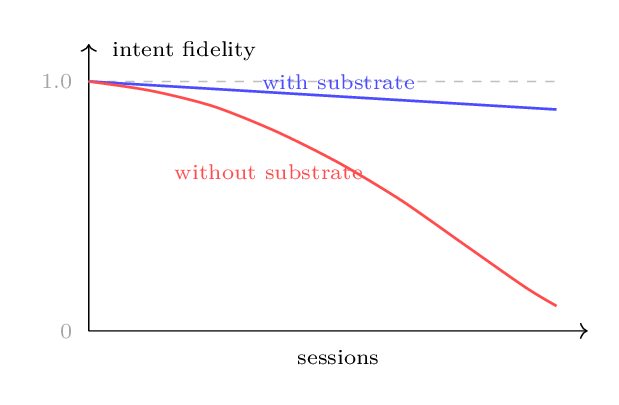
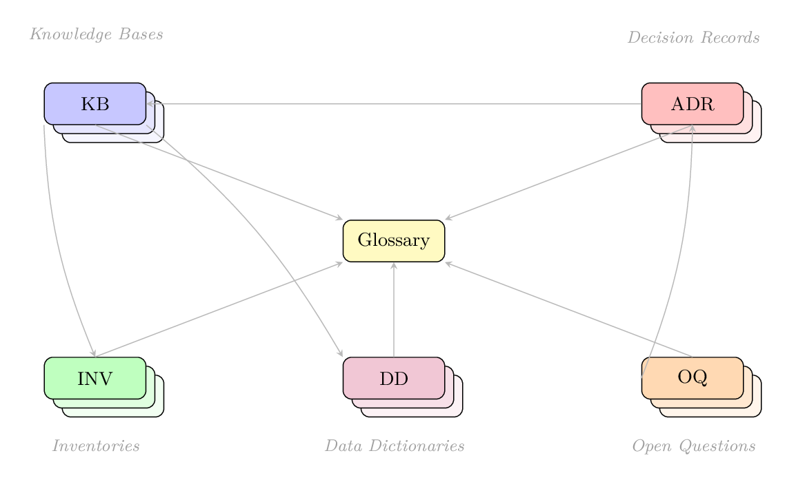
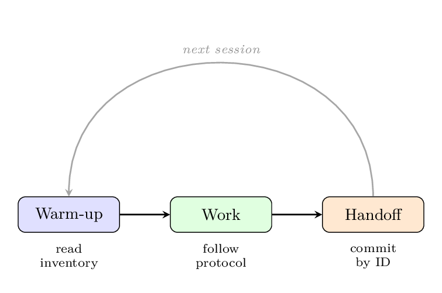
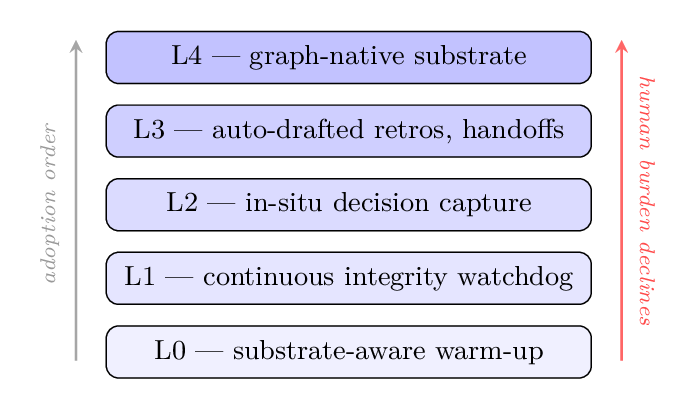
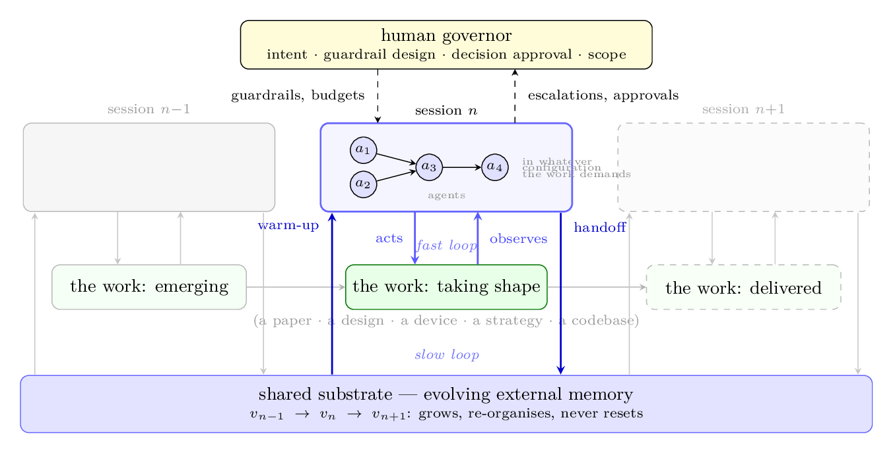

# Shared Substrate

**A discipline for sustained human–AI coupling on complex problems.**

> For complex work that spans many sessions, many decisions, and many abstraction layers, **the substrate matters at least as much as the model** — the substrate being the externalised state any sustained reasoning, organic or artificial, must traverse.

📄 **[Read the paper (PDF)](paper/shared_substrate.pdf)** — draft v0.2, July 2026 · [LaTeX source](paper/shared_substrate.tex) · [Field manual](method/field-manual.md) · [Executive brief](docs/management-brief.md) · [Slide walkthrough](docs/presentation.md)

This README is a digest of the paper: read it end to end and you have the philosophy and its grounding; read the paper for the full specification, the worked examples, and the honest limits.

---

## The problem

Modern AI agents have characteristic limitations on long-horizon work, familiar to anyone who has run a serious multi-week project through them:

- **Context-window saturation** — the project's accumulated state outgrows any window, and grows faster than windows do.
- **Lost-in-the-middle** — content technically present in context is not reliably attended to.
- **Drift across iterations** — each session rebuilds understanding from the last session's reconstruction; the errors compound.
- **Phantom decisions** — asked "did we decide X?", the model reconstructs plausibly rather than recalls; it confidently confabulates decisions never made.
- **Reference rot** — references by path or paraphrase go stale, and the model fills the gap with plausible inventions.
- **Restart cost** — every session begins with the agent's full intelligence intact and the project's accumulated context absent.
- **Decided-vs-considered confusion** — in a chat transcript, options *considered* look identical to options *chosen*.

None of these is a property of any particular model. Each is a property of **unsubstrated collaboration**, and each responds to substrate-level intervention far more reliably than to model-level scaling:

<p align="center"></p>

## The centroid

Picture the participants in sustained work — the human operator, AI agents, successive model generations, colleagues — as noisy point masses in motion. An ensemble of noisy masses left uncoupled has no fixed point: its centre of mass wanders wherever the excursions carry it. That wandering is the drift above.

<p align="center"></p>

The substrate is the deliberately **pinned centroid** of the ensemble — the shared centre of mass of the coupled human–AI system, held steady by discipline rather than by any participant's memory. Every session begins with reversion to the centroid (*warm-up*), works at some excursion from it, and ends by depositing its results back into it (*handoff*). **Drift is excursion without reversion. A model swap moves a point mass; it does not move the centroid.** And the pin is authorship: the substrate is the human's intent given a durable, citable body, fixed not to a place but to the course of the work — what stays constant is reference, not position.

## Intent, embodied

The relation between intent and substrate is the paper's conceptual core, and it is worth stating slowly — because it is the joint where this work connects to everything else.

**Intent is an event in a mind.** The choice of what to build and why, the resolution of a trade-off, the judgment that an option list is missing the one option that matters — each occurs at a moment, from one perspective, and then it is over. Work, by contrast, is extended in time: it spans sessions, tools, model generations, and eventually other minds. Unembodied intent has no duration, no location, and no existence for anyone else — including the operator's own future self, who returns after a gap as, in every respect that matters, another participant.

**The substrate is that event given a body.** Embodiment converts intent from something that *happened* into something that *exists* — and existence has three separable requirements: the embodied intent **persists** (storage), can be **found** (address), and can be **checked** (an oracle appropriate to its layer). The three fail separately, which gives intent three grades of existence:

| an intent that is… | …is |
|---|---|
| merely **remembered** | dead by the next session |
| **recorded** | alive, but lost until rediscovered |
| **addressable** | citable, checkable, and buildable-upon by participants who never met its author |

A musical score stands in exactly this relation to a performance: not the music and not the composer, but the composer's intent in durable, addressable notation — from which any competent orchestra, including one assembled long after the composer, can expand the sound.

**This relation is where several lines of research meet:**

- **The industry framing.** Google's *New SDLC* whitepaper (2026) names the shift as "the transition from writing code to expressing intent, and trusting intelligent systems to translate that intent into working software." Necessary — and one floor short. Intent *expressed* to a machine is still an event: unless embodied, it dies in the chat scroll and is re-expressed every session at rising cost. The deeper shift is from intent expressed to intent **existing** — and it is a shift in how humans engage with information generally, arriving in software first only because software has oracles.
- **Cognitive science.** Distributed cognition (Hutchins) and the extended-mind tradition established that thinking escapes one skull through durable external structure; Popper's "World 3" is the older name for thought given objective existence. The substrate is that result applied to *purpose*, with an address system attached.
- **Software engineering.** Nygard's Architecture Decision Records are embodiment discovered independently for one intent type — the decision. The discipline generalises the same move across the whole abstraction tower.
- **Agentic-AI memory research.** RAG, MemGPT-style paging, and Zettelkasten-style agent memory rediscover the same three requirements from the machine's side. The direction differs, and it matters: those systems embody the *agent's recollection*; the substrate embodies the *human's authorship* — which is why an excellent agent-memory system does not substitute for it.
- **Formal methods.** Intent formalization as the grand challenge (Lahiri) is the checkability requirement pursued to its limit: intent embodied in forms an oracle can act on.

Re-read the drift figure above in this light: the decaying curve is unembodied intent evaporating; the bounded curve is embodiment holding. The centroid's pin is the same statement as an image — authorship, riding the course of the work.

## The discipline: an atlas of layered maps

The substrate is not a pile of notes. It is a structured artefact graph with explicit semantics, organised across an explicit hierarchy of abstraction layers:

<p align="center"></p>

Changes cascade **forward** (down the hierarchy, in the same commit or as an explicit tracked question); they propagate **in reverse** only through a Decision Record — a higher layer is never silently retro-fitted to match what got built.

Six artefact categories partition all project knowledge:

| Category | Holds | Cadence |
|---|---|---|
| **Knowledge Bases** (KB-N) | durable facts about the world the project operates in | changes rarely |
| **Inventories** (INV-N) | exhaustive, machine-checkable lists | changes per feature |
| **Data Dictionaries** (DD-N) | schemas and contracts between components | changes per interface |
| **Decision Records** (ADR-N) | one decision each: context, alternatives, consequences | **append-only** |
| **Open Questions** (OQ-N) | deliberately unresolved questions, with target dates | accumulate and resolve |
| **Glossary** | the singular authority on terminology | grows and stabilises |

<p align="center"></p>

Every cross-reference uses a **stable identifier** (`KB-3`, `ADR-12`) — never a file path, never a paraphrase. Identifiers survive reorganisation; paraphrases rot. Every artefact carries a status (`MISSING → DRAFT → STABLE → STALE → DEPRECATED`) with explicit, triggered transitions, and every non-trivial edit follows a protocol with an impact check and single-source-of-truth enforcement — plus a generously sized trivial-fix lane, because a discipline whose ceremony exceeds its benefit is a discipline that gets bypassed.

The session-level rhythm is identical whether the previous session ended cleanly or crashed:

<p align="center"></p>

## Every layer has a language and an oracle

The central bottleneck of AI-era work is the **intent gap** — the semantic distance between what the operator means and what the produced artefact does. Generated output is *plausible by construction, not correct by construction*, and there is no oracle for specification correctness other than the user. So the discipline pairs every abstraction layer with a **representation formalism** and the strongest available **verification oracle**, spending the human's scarce oracle capacity only where nothing else can substitute for it.

The software instantiation (other domains substitute their own columns — the discipline supplies the pairing, not the particular formalisms):

| Layer | Representation | Oracle | Guardrail |
|---|---|---|---|
| Business behaviour | executable behavioural contracts (Gherkin) | acceptance runs against the live system | behavioural lock-in of the incumbent before replacement |
| Requirements | structured natural language, stable-ID refs | human review of a formal restatement | frozen status; ADR-gated unfreeze |
| Design / contracts | data dictionaries, schemas, ADRs | schema validation; contract tests | single source of truth; propagation rules |
| Implementation | typed code | compiler; property tests; postconditions | syntactic constraints on generation |
| Non-functional envelope | measurable budgets: latency, memory, throughput | runtime instrumentation of incumbent and replacement | budget assertions; canary vs incumbent |

A tower of layers is sound for a theorem-shaped reason: sound approximation between adjacent layers is a Galois connection, and Galois connections compose — so **agent divergence is precisely a violation of the semantic-preservation obligation between the layer the agent was instructed at and the layer it produced.**

## The substrate is a compressed source

Layered by abstraction, the substrate is a **compressed representation of the thing being manifested** — and the agentic pipeline is its decompressor. The top layer is the shortest description; each layer beneath adds only *derivable* detail. What must actually be stored is what no pipeline can re-derive: the choices among alternatives, the intent behind them, the taste that selected this design over that one. The append-only Decision Records are the incompressible kernel.

<p align="center"></p>

**This is the discipline's purpose in one line: separate genuine human creative input from cognitive load.** The human supplies the bits that cannot come from anywhere else — once, at the layer where they belong. Everything derivable — the expansion, the bookkeeping, the propagation, the re-derivation that flat collaboration forces the human to repeat every session — is carried by the substrate and executed by the pipeline. The failure modes above re-read naturally in this frame: *drift* is decoder error accumulating unchecked; a *phantom decision* is the decoder inventing source bits; *restart cost* is retransmission of content that should have been stored compressed.

The reading has a standard formalisation in algorithmic information theory: what is *derivable* from substrate *S* by pipeline *d* is what has negligible conditional complexity *K(x | S)*, and the creative kernel of a deposit is its conditional description length given the prior substrate and the pipeline. *K* is uncomputable, but a strong language model's log-loss on the deposit conditioned on the substrate is a practical estimator — language models are, formally, general-purpose compressors. And the pipeline-relativity is a feature: as pipelines strengthen, more becomes derivable and the kernel shrinks — the formal shadow of the operator's migration up the abstraction hierarchy.

## Observability closes the loop

An oracle the agent cannot query is not a guardrail; it is an audit. For guardrails to be enforced *in the loop* — during the work, not after it — the state of the work must be observable **to the agent**: measurements, traces, and check results exposed as channels the agent can consult cheaply, repeatedly, and without human mediation.

<p align="center"></p>

The reason is the amplifier structure of the coupling. An agent is gain: it multiplies operator intent into volume. But **gain is indifferent to sign** — the same amplification that compounds progress compounds divergence — and an amplifier run open-loop diverges at the rate of its gain:

<p align="center"></p>

A closed loop inverts the economics: each check detects the excursion while it is small, so the cost of correction stays proportional to the excursion rather than to the volume built on top of it. The human's place in this loop is not sensor but **designer** — choosing the contracts, budgets, escalation thresholds, and cadence of checks. Efficient coupling is a control-design problem: give the operator controls that cap excursion early, and the amplifier works for you; omit them, and it works against you — at the same gain.

## Human-governed, agent-executed

The discipline's *content* is fixed; its *execution model* is not. Its posture is: **Shared Substrate is the human-governance schema over substrate execution, agnostic to who — or what — performs the execution.** A five-layer adoption stack progressively delegates the mechanics to agents:

<p align="center"></p>

What never delegates: **intent declaration, decision approval, scope governance, voice.** Seen through the compression reading, the stack is a distillation apparatus — layer by layer it strips cognitive load away from the person until what remains is only the input no pipeline can generate. Delegation is not the human doing less; it is the human's effort converging on the only work that was ever irreducibly theirs.

## The whole system in one picture

<p align="center"></p>

Two nested feedback loops drive the work. The **fast loop** runs within a session: agents act on the work and observe its actual state against the guardrails. The **slow loop** runs across sessions: every participant reverts to the substrate at warm-up and deposits back at handoff — and what the fast loop finds, the slow loop keeps, because violations, escalations, and the decisions they force are themselves deposited as substrate records. Sessions end, agents are swapped, the work ships; **the evolving substrate is the only element that neither resets nor retires.**

## How it is grounded

The discipline offers no new component; it integrates, at the level the operator inhabits, results from four traditions that converged independently on the same shape — which is itself evidence the shape is a recurrent solution:

| Discipline element | Grounding | Failure mode addressed | Executed by |
|---|---|---|---|
| Hierarchy of abstraction layers | Marr's levels of analysis; hierarchical predictive coding | drift; lost intent | human; L4 |
| Single source of truth | external representations (Scaife & Rogers); cognitive load (Sweller) | decided-vs-considered; reference rot | L1 |
| Stable identifiers | boundary objects (Star & Griesemer) | reference rot; phantom decisions | L1 |
| Append-only decision records | distributed cognition (Hutchins); ADRs (Nygard) | phantom decisions; silent reversal | L2 + human approval |
| Status lifecycle | schema theory (Bartlett) | drift; stale knowledge | L1 |
| Edit protocol + trivial lane | cognitive load theory; chunking (Miller; Cowan) | restart cost; over-ceremony abandonment | L1–L3 |
| Glossary as semantic anchor | encoding specificity (Tulving) | terminology drift | L1 |
| Warm-up + handoff protocol | cognitive offloading (Risko & Gilbert) | restart cost; window saturation | L0, L3 |

- **Cognitive science** — cognition is distributed across people, tools and environment; external representations change what operations are possible; working memory holds ~4 chunks; human recall is reconstructive and confabulates exactly the way LLMs do. The remedy humans have used for millennia is a stable external trace.
- **Software engineering** — ADRs, single source of truth, hexagonal separation, crash-only restart: independently developed practices converging on a disciplined, externalised, append-only, sparingly cross-referenced substrate.
- **Agentic-AI research** — RAG, MemGPT-style memory paging, generative-agent reflection, constitutional rules, Zettelkasten-style agentic memory: system designs recapitulating the same substrate shapes. Even harness vendors converged on auto-loaded project-root instruction files.
- **Formal foundations** — intent formalization as the grand challenge (Lahiri); Galois-connection towers for layer soundness (Cousot & Cousot); grammar-constrained decoding and its limits (constraint ≠ correctness ≠ safety); rate–distortion theory as the skeleton for making the compression reading quantitative.

## The evidence, honestly

The empirical record on AI-assisted work is genuinely contested — and the discipline treats that as its strongest motivation, not an inconvenience:

- A rigorous RCT (METR, 2025) found experienced developers **19% slower** with AI tools on mature codebases they knew well — while believing, even afterwards, that they had been 20% faster. Felt productivity cannot be trusted; only externalised, inspectable state can be.
- Field experiments across 4,867 developers found **+26%** completed tasks, concentrated among less experienced developers.
- A controlled greenfield task found **+56%**.

The moderators that reconcile these — task abstraction level, project maturity, operator experience — are precisely substrate-adjacent variables. **The discipline is an intervention on those moderators, and the claim is falsifiable:** if practised substrate discipline does not move experienced operators on mature projects out of the slowdown regime, the thesis fails.

The paper also draws the consequence for measurement: in a coupled environment, productivity is not generated volume — the amplifier inflates volume regardless of sign, which is why slowed-down developers sincerely felt faster — but **validated intent made durable** per unit of scarce human input (creative kernel, oracle capacity, loop time). Unverified volume is not output; it is rework not yet scheduled.

Concretely, the paper sketches the accounting. The **creative kernel** of a deposit $x$ is its conditional description length given the prior substrate $S$ and pipeline $d$, estimated by a strong model's code length:

$$\kappa(x) \;=\; K(x \mid S, d) \;\approx\; -\log p_\theta(x \mid S)$$

**Validated intent made durable** over a period accrues kernel bits weighted by the discriminating power $v(x) \in [0,1]$ of the contracts locked (mutation kill rate — resistant to padding) and their survival $s_k(x)$ after $k$ sessions:

$$I_T \;=\; \sum_{x \in \mathcal{D}_T} \kappa(x)\, v(x)\, s_k(x)$$

**Productivity** is net accrual per unit of scarce human time, with divergence debt $\Delta D_T$ — unverified volume priced at its empirically observed rework rate — entering as a liability:

$$P_T \;=\; \frac{I_T \;-\; \lambda\, \Delta D_T}{t_{\mathrm{kernel}} + t_{\mathrm{oracle}} + t_{\mathrm{load}}}$$

Note what $P_T$ does not contain: gross generated volume $V_T$ — the quantity felt productivity tracks. The ratio $V_T / I_T$ is a project's calibration failure, measurable continuously instead of discovered in a randomised trial. Every term comes from event streams the substrate already externalises; the metering layer is the L1 integrity watchdog, read for a second purpose.

## Heavy in full — useful in parts

The full specification reads heavy, and that is the right first impression to correct: **the discipline adopts à la carte.** Its elements are separable by design — each targets its own failure mode — so the synthesis table above doubles as an adoption menu:

| If this is what hurts | Adopt just this | Cost |
|---|---|---|
| Phantom decisions ("did we decide X?") | the append-only ADR log | minutes per decision |
| Monday restart cost | bootstrap pointer file + one-page inventory | an hour, once |
| Terminology drift | the glossary | grows organically |
| Reference rot | stable IDs in cross-references | a habit, not a tool |
| Rework surprises on one scary component | executable behavioural contracts, there only | a day |
| Performance regressions in a rebuild | NFR budgets captured from the incumbent | a day |

Each element pays back independently; combined they compound, and the full discipline is simply the limit of that compounding. The one near-universal prerequisite is stable identifiers — they cost nothing and underwrite everything else. Nothing here is all-or-nothing.

## Honest limits

The paper names where the discipline does not help: genuinely novel research whose right ontology is unknown until the work is mostly done; projects below a complexity threshold (a handful of sessions, decisions, collaborators — use flat notes); the bureaucracy risk when ceremony exceeds benefit; the hidden expertise requirement (a substrate is no better than the judgement of its author); multi-author coordination (its own open problem); and the failure modes agentic execution itself introduces (confabulated decision drafts, drafting-bias drift, over-delegation). The discipline preserves reasoning; it does not produce it. A well-organised wrong project is still wrong.

## In the field

The paper walks through two worked examples: a greenfield multi-month build of a live algorithmic-execution engine (watching the substrate grow from a flat requirements document to a governed artefact graph), and a brownfield replacement of a legacy low-latency process at a regulated financial institution in roughly two weeks — where the incumbent system served as the oracle at every layer, its behaviour locked in as executable contracts and its memory/latency profile captured by runtime instrumentation and held as budgets. The consistent observation: **generation was never the bottleneck; locking intent, layer by layer, was the critical path.**

## Repository layout

```
shared-substrate/
├── paper/
│   ├── shared_substrate.tex     # canonical draft (v0.2) — LaTeX source
│   ├── shared_substrate.pdf     # built PDF
│   ├── references.bib           # bibliography (entries verified against arXiv)
│   └── archive/                 # v0.1 draft (Cognitive Cartography), frozen
├── method/
│   ├── field-manual.md          # the compact field manual
│   └── amendments-log.md        # historical amendment record from the origin project
├── docs/
│   ├── presentation.md          # slide walkthrough (Marp-compatible) with worked examples
│   └── management-brief.md      # one-page executive brief
├── research/
│   └── human-ai-centroid-research.md   # literature survey grounding the paper
├── assets/                      # figures rendered from the paper's TikZ sources
├── CITATION.cff
└── LICENSE                      # CC BY 4.0
```

## Building the paper

Requires a standard TeX Live installation (`tikz`, `booktabs`, `natbib`, `hyperref`, …).

```bash
cd paper
latexmk -pdf shared_substrate
```

## Status and roadmap

**Draft v0.2** — a self-contained articulation of the method and its grounding, suitable for reading and discussion. Not yet submitted anywhere.

The research programme it opens, deliberately flagged in the paper as future work:

- a rate–distortion treatment of the human↔agent specification channel (rate = specification effort; distortion = residual intent misalignment);
- formal per-layer representation optimality (description length × macro-expressibility × distortion);
- measurable non-functional contracts as first-class, layer-attached specifications;
- pre-registered empirical tests against the contested productivity baselines.

## Provenance

The discipline documented here was not invented for the paper. It is the articulation of a practice cultivated by the author over years across many domains; collaboration with current-generation AI agents is what made its elements demand explicit naming. AI assistance in *writing* the paper is acknowledged in the paper's Acknowledgements — a collaboration conducted, fittingly, in the discipline the paper describes.

## Citing

See [CITATION.cff](CITATION.cff), or:

```bibtex
@misc{roshka2026sharedsubstrate,
  author = {Roshka, Oleg},
  title  = {Shared Substrate: A Discipline for Sustained Human--AI Coupling on Complex Problems},
  year   = {2026},
  note   = {Draft v0.2},
  url    = {https://github.com/olegroshka/shared-substrate}
}
```

## License

[CC BY 4.0](LICENSE) — share and adapt with attribution.
