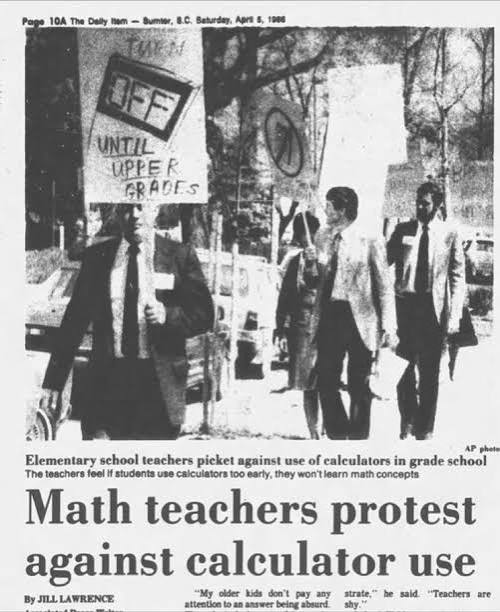

# The Human Edge Becomes the Job: On Moving Up the Abstraction Stack

<!--
LinkedIn article draft — v1 (2026-08-01)
Status: DRAFT, not yet posted.

Visuals (7), in order of appearance:
  1. ../assets/fig-drift.png        (repo)
  2. ../assets/fig-centroid.png     (repo)
  3. ../assets/fig-projection.png   (repo)
  4. ../assets/fig-loop.png         (repo)
  5. ../assets/fig-stack.png        (repo)
  6. assets/lyon-canut-revolt.jpg          (period print, public domain)
  7. assets/calculator-protest-1986.jpg    (newspaper scan, third-party)

Rights note: the two historical images are third-party material and are
NOT covered by this repository's CC BY 4.0 license. The Lyon print is
public domain. The 1986 clipping (AP photo via The Daily Item, Sumter,
SC) is used here as historical commentary; its caption acknowledges the
contested online provenance while standing on the uncontested fact of
the 1980s calculator-adoption fights.

Paper link at the end: SSRN page once live; GitHub repo meanwhile.
Tags (max 3): #AI #FutureOfWork #SoftwareEngineering
-->

The most useful sentence in the debate about AI and work is also the least
comfortable one: **whatever the human is genuinely better at than the machine
stops being a comparative advantage and becomes the entire job.**

Not less work. A different job — one level up. This piece is about what that
job is, why it needs an apparatus most teams have not built yet, and why the
discomfort surrounding all of it is centuries old and right on schedule.

## What the machines are actually good at

Strip away both the marketing and the doom, and the systems we now work
beside are exceptionally good at one broad thing: **local representation
transformation**. Specification into code. Code into tests. A document into
its summary. A schema into an adapter. One formalism into an adjacent one —
competently, repeatably, at near-zero marginal cost. Each is a mapping
between neighbouring representations, where the context the mapping needs is
largely present in the input itself.

That is not a small thing. An enormous share of professional knowledge work
is, honestly described, local transformation. This is why the current wave
feels different from earlier tooling: it does not accelerate one niche
operation — it collapses the price of the general operation underneath
thousands of them.

## What they are not good at

What these systems do not reliably do is **global hierarchical layering**:
holding a real project's whole tower of abstractions at once — purpose above
requirements, requirements above design, design above implementation — and
catching the subtle dependency no single transformation step exposes. The
constraint at layer one that quietly invalidates a choice at layer four. The
option list that satisfies every stated requirement while missing the one
option that would have kept the original goal. The document correct in every
clause while the intended reader has been lost entirely.

These failures share one shape: **every local step is plausible; the global
structure is wrong.** And the cause is structural, not temporary. Local
transformation needs only the context in front of it. Global layering needs
a durable model of *intent* — why the tower is shaped the way it is — and
intent is precisely what cannot be derived from the artifacts alone. Left
unattended, the gap compounds: each session's understanding is a slightly
perturbed reconstruction of the last, and fidelity to the original intent
decays across sessions.

*The drift spectrum, stylised: without an external record of intent,
fidelity decays across sessions; with one, decay is bounded.*

## The inversion

As everything derivable moves to the machine's side of the table, human
effort converges on what was never derivable in the first place: **declaring
intent, resolving trade-offs, shaping structure, judging meaning.** That
role has a name: the human becomes an **intent engineer** — author of the
non-derivable bits, architect of the layered structure through which
machines expand them into work.

Delegation, on this reading, is not the human doing less. It is human effort
converging on the only contribution nothing else can make.

## Intent, embodied

Here is the difficulty: intent is an *event in a mind*. It happens at a
moment, from one perspective — and then it is over. Work, by contrast, spans
sessions, tools, model generations, and eventually other minds — including
one's own future self, returning after a gap as, in every practical sense,
another participant.

So the higher job begins with an act of embodiment: converting intent from
something that *happened* into something that *exists* — something that
persists, can be found, and can be checked. An intent that is merely
remembered dies with the session. One that is recorded survives but must be
rediscovered. One that is **addressable** can be cited, tested, and built
upon by participants who never met its author.

The picture that organises this is the **centroid**: the participants in
sustained work — human, agents, successive models, colleagues — are noisy
point masses in motion, and the substrate of embodied intent is the
deliberately *pinned* centre of mass of that ensemble. Every session begins
by reverting to it (warm-up), works at some excursion from it, and deposits
its results back (handoff). Drift is excursion without reversion. A model
upgrade moves a point mass; it does not move the centroid.

*The pinned centroid: the substrate is intent, embodied — the fixed point
the whole ensemble reverts to, pinned by authorship to the course of the
work.*

## The substrate is a compressed source

The deepest reading of that apparatus is information-theoretic: the
substrate is a **compressed representation of the work being made**, and the
machine pipeline is its decompressor. The layers make the compression
progressive — the top layer is the shortest description; each layer beneath
adds only detail that cannot be derived from above. The human deposits
exactly the non-derivable bits — intent, decisions, taste — once, at the
layer where they belong; agentic pipelines expand the compressed source into
the manifested work; and whatever the expansion *discovers* that could not
have been re-derived is deposited back.

This gives the whole discipline its one-line purpose: **separate genuine
human creative input from cognitive load.** Everything derivable — the
re-explaining, the bookkeeping, the re-derivation that undisciplined
collaboration forces a person to repeat every session — is the machine's to
carry.

*The substrate as compressed source: the human deposits what no pipeline can
derive; agentic pipelines expand it into the work; non-derivable discoveries
deposit back.*

## Every layer gets an oracle — and the loop stays closed

Compression is safe only if expansion is checked. So each layer of the tower
is paired with a representation it is written in and an **oracle** that can
catch divergence at that layer — executable behavioural contracts at the
top, schema and contract tests in the middle, measured runtime budgets at
the bottom. And critically, the work's state is kept observable **to the
machines themselves**: an oracle the agent cannot query is not a guardrail,
it is an audit. Amplification is indifferent to sign — the same gain that
compounds progress compounds divergence — so run open-loop, fast help
becomes fast harm; run closed-loop, every excursion is caught while
correction is still cheap.

The human's place in that loop is *designer*, not sensor: choosing the
contracts, the budgets, the thresholds at which the machine must stop and
escalate — because no human can read everything an amplifier produces, and a
loop that is safe only while a person watches it has not been designed at
all.

*Observability closes the loop: the human governor designs guardrails and
budgets; the work's state feeds back through channels the agent queries
directly.*

## Human-governed, agent-executed

None of this requires the human to do the substrate's clerical work forever.
The practice delegates progressively: machines draft the records, propagate
changes across layers, watch for contradictions — while four things never
delegate: **intent declaration, decision approval, scope governance,
voice.** Each rung of that ladder strips more cognitive load from the
person, until what remains is only the input no pipeline can generate. Which
is the inversion again, seen from the other side: the ladder does not shrink
the human role — it distills it.

*The adoption stack: execution delegates rung by rung; intent, decisions,
scope and voice never do.*

## The shift is visible in the logs

Two measurements make this concrete, comparing projects run *with* and
*without* that substrate. They come from session logs of my own projects — a
case comparison across one practice, not a controlled study — but they point
one way.

**The re-entry tax.** Every AI-assisted session starts by rebuilding
context. In the substrated project, re-entry cost about a hundred characters
and *fell* as the project matured — the record was doing the explaining. In
a comparable project without the substrate, re-entry cost roughly **four
times more and rose over the project's life**: an operator progressively
re-explaining his own intent to his own tools.

**Where the attention goes.** Classify every operator message by what it
does — declaring intent, deciding, shaping design, versus mechanical
steering (*paste this error, fix that line*). Comparing messages of similar
length, the substrated practice ran ahead **in every length group**:
conceptually denser messages, fewer mechanical nudges. When intent has an
address, a short message can dispatch prepared work; without one, a short
message can only tell the machine to keep going. The higher job has a
visible signature.

## The consensus is converging

This is not a solitary reading. Google's *New SDLC* whitepaper
(2026) — a practical, team-level playbook rather than a conceptual
treatment — names the same shift: the move "from writing code to expressing
intent," trusting intelligent systems to carry that intent into working
software. Arriving from the practical end, it points in the same direction
this work reaches from the conceptual one — and the difference in altitude
is exactly what makes the two complementary:

| | Google's *New SDLC* (2026) | this work |
|---|---|---|
| the shift named | from writing code to expressing intent | from producing representations to engineering intent |
| register | practical — a playbook for teams | conceptual — why it works: cognitive science, information theory, control |
| the further step | intent expressed to the system | intent **embodied** — durable, addressable, checkable — so it outlives the session that expressed it |

The further step matters because intent *expressed* is still an event: unless
embodied, it dies in the chat scroll and is re-expressed every session at
rising cost — that is precisely the re-entry tax measured above. (For the
record of independent convergence: the first draft of this conceptual work,
*Cognitive Cartography*, was published on GitHub in April 2026.)

## The revolt is on schedule

*"Horrible massacre à Lyon" — a period print of the canut revolt. Lyon's
silk weavers rose twice in three years, 1831 and 1834, as mechanized looms
and collapsing piece-rates reset their trade.*

In 1831 and again in 1834, the silk weavers of Lyon rose as mechanization
reset their trade. A century and a half later, teachers picketed the pocket
calculator.

*"Math teachers protest against calculator use" — an AP photo as printed in
The Daily Item, Sumter, South Carolina, 1986. The clipping's online
provenance has been contested; the fact it records has not — through the
1980s, educators and school boards genuinely fought calculator adoption in
schools.*

It is easy to smile at both. It is more accurate to notice that both were
**correct about the pain**: a machine really was repricing a skill that
felt, from the inside, identical to competence itself. Change at that depth
is resisted below the level of argument — it challenges the status quo
somewhere near identity — so the resistance arrives before the articulation
does. It will arrive this time too. Pushback at this scale is not a sign the
change is failing; it is the signature of the change being real.

What both protests misjudged was the direction. Arithmetic did not die; the
bar moved up, to modelling and reasoning. Weaving did not die; the craft
moved into design and engineering. **The repricing never abolishes the
discipline. It moves the humans willing to move.**

## The bar only moves one way

A human who stays at the transformation layer now competes with the machine
on the machine's terms, and the terms worsen every quarter. A human who
moves up — who embodies intent once, precisely, at the layer where it
belongs, and audits the tower for the dependencies no local step reveals —
is not made smaller by the machines. They are the one participant the whole
system cannot function without.

The bar is rising. It has risen before. Moving up is the job now.

## The scoreboard moves with it

One consequence deserves to be stated plainly, because most organisations
have not drawn it yet: **if the job changes, the metrics must change with
it.** Volume metrics — lines produced, tickets closed, output generated —
now measure the amplifier, not the person. An amplifier inflates volume
regardless of direction; the most careful field study to date found
experienced developers slowed down by AI tooling while sincerely believing
they were faster, precisely because felt productivity tracks volume.
Measuring generated volume in a coupled environment is measuring the
machine's exhaust.

What is actually scarce — and therefore what is actually worth measuring —
is **human attention and creative input**: the non-derivable contribution.
Performance measurement should move to the qualities of applied intent — how
much of a person's judgment became durable, validated, and built upon;
decisions that held; structure that caught errors early; the option nobody
else saw. These are harder to count than volume. They are also the only
thing left that the person, rather than the pipeline, is producing.

The same logic ranks organisations — and at that level it is not specific
to any one methodology. Whatever the AI-assist practice a company adopts,
its best interest is the same: configure the working environment the way an
operating theatre is configured — every pipeline, artifact and tool arranged
in advance so that repetitive, derivable work is offloaded to machines and
the scarce resource, **human attention, is protected for the judgment only
people can supply**. Every hour an employee spends re-explaining context,
re-deriving what was already decided, or mechanically steering a tool is
that resource burned on load a machine should carry. The organisations that
configure themselves for cognitive offload will compound an advantage over
those that spend attention on retransmission — not because their people work
more, but because more of what their people do is work only people can do.

---

*The discipline sketched here — the substrate's layers and artifact types,
the oracle pairings, and the division of labour between human governance and
machine execution — is articulated in full in the working paper "Shared
Substrate: A Discipline for Sustained Human–AI Coupling on Complex
Problems", available at
[github.com/olegroshka/shared-substrate](https://github.com/olegroshka/shared-substrate).*
<!-- TODO before/after posting: once the SSRN preprint is live, replace (or
supplement) the GitHub link with the SSRN abstract page / DOI — the citable
form is better for this audience. -->
