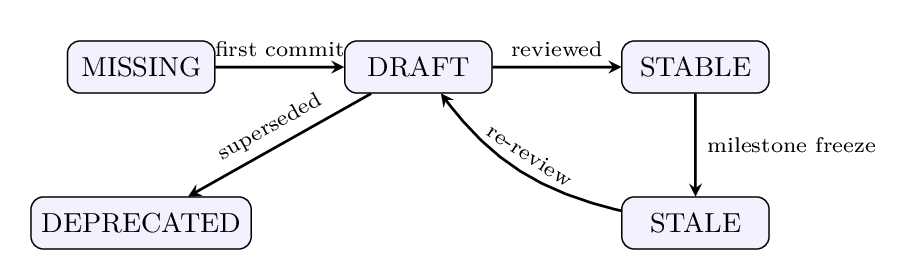
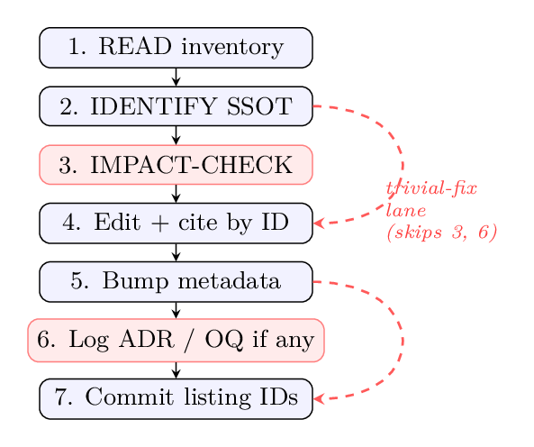

<!--
Render as slides:  npx @marp-team/marp-cli docs/presentation.md -o slides.html
Or open in VS Code with the Marp extension. Reads as plain markdown on GitHub.
-->

# Shared Substrate

## A discipline for sustained human–AI coupling on complex problems

**A walkthrough, with worked examples from software engineering**

Oleg Roshka · draft v0.2 · [github.com/olegroshka/shared-substrate](https://github.com/olegroshka/shared-substrate)

---

## A conversation you have probably had

Week 3 of a project. You and your AI assistant, building a live execution engine.

> **You:** Why are we acquiring advisory locks here?
> **Agent:** As we agreed earlier, Postgres advisory locks let us avoid the outbox table.

**Nobody agreed that.** It was *mentioned once*, as one of three options, three weeks and forty conversations ago.

The agent is not lying. It is doing what any reconstructive memory does: pattern-completing from what's in view. Human memory does the same — humans just also have sticky notes, colleagues, and shame.

This talk is about the sticky notes.

---

## Seven ways unsubstrated collaboration fails

| Failure | What it looks like in practice |
|---|---|
| **Context saturation** | "Let me summarize where we are…" — and the summary drops the constraint that mattered |
| **Lost in the middle** | The fact from message 5 is honoured; the fact from message 45 is contradicted |
| **Drift** | "position" meant *net signed quantity* in week 1; by week 3 it sometimes means *gross exposure* |
| **Phantom decisions** | the advisory-locks conversation on the previous slide |
| **Reference rot** | "see the latency section" — the section was refactored away; the agent invents its contents |
| **Restart cost** | every Monday begins with 20 minutes of re-explaining the project to a genius amnesiac |
| **Decided vs considered** | options *discussed* accumulate the same status as options *chosen* |

None of these is a property of the model. All are properties of **what survives between sessions**.

---

## Without intervention, intent fidelity decays

<p align="center"></p>

- Each session rebuilds understanding from the previous session's *reconstruction* — errors compound.
- Bigger context windows **postpone** the curve. They do not change its shape: the project's accumulated state grows faster than any window.

---

## And the measured evidence should worry you

- **METR RCT (2025):** 16 experienced open-source developers, 246 real tasks on mature repos they knew well. With AI tools: **19% slower**. Their forecast: 24% faster. Their belief *afterwards*: 20% faster.
- **Cui et al. (2026):** 4,867 developers, three field experiments: **+26%** completed tasks — gains concentrated in *less* experienced developers.
- **Peng et al. (2023):** greenfield, well-specified task: **+56%** faster.

Same class of tools. Opposite outcomes. The moderators: **task abstraction level, codebase maturity, operator experience.**

> The scary part is not the slowdown. It is the *calibration failure*: the slowed-down group sincerely believed they were faster. You cannot manage what you measure by feel.

---

## The thesis

### For complex work spanning many sessions, many decisions, and many abstraction layers, **the substrate matters at least as much as the model.**

The **substrate** = the externalised state any sustained reasoning must traverse: what is read at session start, written during, and left behind for the next session.

Undisciplined, it is chat scroll and scattered notes. Disciplined, it is a structured, versioned, cross-referenced artefact graph — and the failure modes above respond to it more reliably than to any model upgrade.

---

## The organising image: a pinned centroid

<p align="center"></p>

- Participants — you, agents, next quarter's model, a new colleague — are **noisy point masses**.
- The substrate is the ensemble's **deliberately pinned centre of mass**.
- Session drift = *excursion*. Warm-up = *reversion*. **A model swap moves a point mass; it does not move the centroid.**

<!-- Speaker note: this is why the method survives vendor churn — swap Claude for its successor mid-project and the project doesn't notice. -->

---

## Purpose, in one line

# Separate genuine human creative input from cognitive load.

- **Creative input** — the choices, the intent, the taste. What no pipeline can derive.
- **Cognitive load** — the re-explaining, the re-deriving, the bookkeeping. Everything a pipeline *can* derive.

The human deposits the first, **once, at the right layer**. The machinery carries the second. Everything that follows is the engineering required to make this separation real — and measurable.

---

## Not invented — recovered

Four traditions converged independently on the same shape:

- **Cognitive science** — cognition is distributed across people, tools, environment (Hutchins' ship navigation); external representations change what thinking is possible; working memory holds ~4 chunks; human recall is *reconstructive* and confabulates exactly like an LLM.
- **Software engineering** — Architecture Decision Records, Single Source of Truth, hexagonal separation, crash-only restart.
- **Agentic-AI research** — RAG, MemGPT memory paging, agent reflection, Zettelkasten-style agentic memory. Even harness vendors converged: every serious AI coding tool now auto-loads a project-root instruction file.
- **Formal methods** — intent formalization (Lahiri), abstract interpretation (Cousot & Cousot), algorithmic information theory.

Independent convergence on one shape is evidence the shape is a *recurrent solution*, not a fashion.

---

# Part I — The Discipline

*What the substrate is made of, concretely*

---

## Layers: every project has an abstraction tower

<p align="center"></p>

Running example — **an execution engine bridging a research backtester to a broker**:

- **Vision** — "strategies validated in research run live, safely, with full cost accounting"
- **Requirements** — "orders never exceed position limits; every fill reconciled within 1s"
- **Design** — hexagonal core; broker adapter behind a port; event-driven loop
- **Code / Tests / Ops** — the 50k LOC that expand all of the above

**Forward propagation:** a requirements change flags design, code, tests for review — same commit, or a tracked question. **Reverse propagation:** implementation discovers a constraint → the higher layer changes **only through a Decision Record**. Never silently.

---

## Six artefact categories — with their concrete faces

| Artefact | Running example |
|---|---|
| **KB-7** Knowledge Base | *Broker API: pacing & rate limits* — 50 msg/s, burst 100; violations → 10-min ban |
| **INV-2** Inventory | *Every supported order type* — market, limit, stop, … (machine-checked against code) |
| **DD-4** Data Dictionary | *Order schema* — `qty: int > 0`, `side ∈ {BUY, SELL}`, `tif ∈ {DAY, IOC}` + invariants |
| **ADR-12** Decision Record | *Event-driven engine for live execution* (next slide) |
| **OQ-23** Open Question | *FIX or REST for order entry?* — options, criteria, **resolve by 2026-05-15** |
| **Glossary** | *"fill"* = broker-confirmed execution; **not** our internal match event |

Every piece of project knowledge belongs to **exactly one** category. Every fact has **one home**.

---

## What an artefact actually looks like

```markdown
---
id: ADR-12
title: Event-driven engine for live execution (not vectorized)
status: STABLE
owner: oleg
last_reviewed: 2026-03-02
depends_on: [KB-7, DD-4]
referenced_by: [INV-2, OQ-23, KB-10]
---

## Context
Live execution needs per-order cost & slippage modelling and
volume-participation limits (see KB-7 pacing constraints).

## Decision
Event-driven daily loop for live. Vectorized path stays research-only.

## Alternatives considered
Vectorized (vectorbt wrapper) — rejected: cannot model volume
participation < 100%; cost approximations unacceptable live.

## Consequences
Research/live parity must be asserted by test suite (INV-2 gate).
```

Append-only. To reverse it: a **new** ADR with a `supersedes: ADR-12` link. The reasoning trail survives.

---

## Stable identifiers: the cure for reference rot

**Fragile** (rots): 
> "as discussed in the requirements doc, the section about latency"

*File reorganised → the agent reconstructs what such a section "would have said." You cannot tell reconstruction from quotation.*

**Stable** (survives):
> "per **KB-7 §3**, burst limit is 100 msg/s"

`KB-7` is `KB-7` whether the file lives in `docs/kb/`, `kb/`, or was renamed twice. Cross-references by ID + `depends_on` / `referenced_by` fields turn the substrate into a **navigable graph** — which enables impact analysis, orphan detection, and automation (Part IV).

---

## The artefact graph — the atlas

<p align="center"></p>

The Glossary anchors the semantics; everything cites by ID. This graph **is** the project's externalised understanding.

---

## Every artefact has a status — and transitions are triggered, not vibes

<p align="center"></p>

- `STABLE → STALE` is **automatic**: unreviewed at a milestone freeze, or an upstream artefact changed.
- A `STABLE` label with a six-month-old review date on a fast project is a lie. The lifecycle makes it visibly a lie.

---

## The edit protocol — walkthrough with a real change

**Task: raise max order size from 5,000 to 10,000 shares.**

<p align="center"></p>

1. **READ** inventory → the fact lives in **DD-4** (Order schema), status `STABLE`
2. **IDENTIFY SSOT** → DD-4 is the one home; the number is *cited* in ADR-9 and tests
3. **IMPACT-CHECK** → walk `DD-4.referenced_by` = [ADR-9, INV-3, KB-7] → KB-7 says broker rejects > 8,000 without algo-slicing ⚠️ **the check just caught a production incident**
4. Edit DD-4 (to 8,000, not 10,000) + file **OQ-31**: "do we need algo-slicing for larger parents?"
5. Bump `last_reviewed`, `version`
6. Commit: `DD-4 v0.4: raise max order size to 8000 (KB-7 constraint); opens OQ-31`

*Typo in a comment? Trivial-fix lane: skip steps 3 and the logging. If you're unsure it's trivial — it isn't.*

---

## Anti-patterns: the "do not" list (top 5 of 11)

1. **Decide in conversation without an ADR** → this is where phantom decisions are born
2. **Paste the same content in two artefacts** → they *will* diverge; you'll notice at the worst time
3. **"I'll update the tests later"** → deferred propagation is next session's drift
4. **Edit a past ADR's body** → history rewritten; supersede instead
5. **Mix layers** — config values in the Glossary, file paths in Requirements → each layer loses its language

Cheap insurance: the list is short, explicit, and append-only.

---

## The session protocol — same path every time

<p align="center"></p>

**Warm-up** = reversion to the centroid. In practice, a project-root bootstrap file every agent harness auto-loads:

```markdown
# CLAUDE.md  (equally: AGENTS.md, .cursorrules — the pattern, not the vendor)
Before any work:
1. Read CONTEXT_INVENTORY.md  (artefact index + statuses + priority queue)
2. Read the protocol TL;DR
3. Read the depends_on closure of today's task
Cite artefacts by stable ID. Decisions → ADR. Questions → OQ.
```

A **pointer**, never a restatement — restated content is content that drifts. Crash or clean exit, the next session takes the same path. There is no separate "recovery mode": recovery **is** the mode.

---

# Part II — Every Layer Has a Language and an Oracle

*Where guardrails become concrete*

---

## The intent gap

> LLM output is **plausible by construction, not correct by construction**. — after Lahiri (2026)

Concrete: you ask for "a resilient order-submit with retries." The agent produces a beautiful retry loop —

```java
try { broker.submit(order); }
catch (Exception e) { retry(order); }   // plausible!
```

— which retries on `DuplicateOrderException` too, and now you double-submit into the market. Nothing about the code *looks* wrong. **The gap between what you meant and what it does is the intent gap** — and AI widens it by producing volume faster than scrutiny keeps up.

The one oracle that cannot be automated: *the user*. Everything below that layer can and must get a mechanical one.

---

## The pairing: representation + oracle + guardrail, per layer

| Layer | Representation | Oracle | Guardrail |
|---|---|---|---|
| Business behaviour | Gherkin scenarios | acceptance runs vs the live system | lock the incumbent's behaviour **before** replacing it |
| Requirements | structured NL + stable IDs | human review of a formal restatement | frozen status; ADR-gated unfreeze |
| Design / contracts | DDs, schemas, ADRs | schema validation; contract tests | SSOT + propagation rules |
| Implementation | typed code | compiler; property tests; postconditions | syntactic constraints on generation |
| Non-functional envelope | measurable budgets | runtime instrumentation | budget assertions in CI; canary vs incumbent |

Domain-general principle, software instantiation. A research project substitutes: pre-registered hypotheses, held-out data, provenance checks.

---

## Layer 1 concretely: behavioural lock-in with Gherkin

```gherkin
Scenario: Reject an order that would breach the position limit
  Given an account with position limit 10,000 shares of AAPL
  And a current position of 9,500 shares
  When a buy order for 1,000 AAPL arrives
  Then the order is rejected with reason "POSITION_LIMIT"
  And nothing is sent to the broker

Scenario: Partial fills reconcile within one second
  Given a working limit order for 5,000 MSFT
  When the broker reports fills of 2,000 and 1,500
  Then position shows 3,500 within 1 second
  And remaining open quantity shows 1,500
```

- Executable. Business-readable. **This is the contract at the top layer** — "done" means these pass against the running system, not "looks right in review."
- In a brownfield rebuild: write these against the **incumbent first**. Now the old system's actual behaviour — not its documentation — is locked in as the acceptance bar.

---

## Bottom layer concretely: the non-functional envelope

Formal-methods-for-AI work is ~all functional correctness. In real systems **the envelope is the binding constraint** — and it has an oracle most projects already own: *the incumbent*.

```yaml
# NFR-3: performance budgets — locked from incumbent (JMX, 30-day p99)
heap_alloc_rate:        <= 220 MB/s      # incumbent p99: 214
gc_pause_p99:           <= 8 ms
order_ack_latency_p99:  <= 350 µs
verification: replay tape 2026-03-14; assert continuously in CI
```

- Capture via **JMX statistics**; where finer resolution is needed, **bytecode-level instrumentation of allocation sites**.
- The replacement must meet the budgets *continuously* — not in a benchmark theatre at the end.
- Why not just constrain generation? Grammar-constrained decoding guarantees **syntax only** — and can itself be exploited. Constraint ≠ correctness ≠ safety. Hence: an oracle at *every* layer, each blind to the layers above it.

---

## Why a tower of layers is trustworthy at all

- Sound approximation between two layers is a **Galois connection** (abstract interpretation, Cousot & Cousot 1977).
- Galois connections **compose** — so if each adjacent pair preserves soundness, the whole tower does.

The practical payoff is a *precise definition of divergence*:

> **An agent diverges when it violates the semantic-preservation obligation between the layer it was instructed at and the layer it produced.**

"The code passes its tests but does something Requirements never sanctioned" is not bad luck — it is a broken layer contract, and the propagation rules exist to detect exactly that.

---

# Part III — Observability, Amplification, and What Productivity Means

---

## An oracle the agent cannot query is not a guardrail. It is an audit.

<p align="center"></p>

- The work's state — test results, metrics, logs, budget checks — must be **readable by the agent, on demand**, without human mediation (endpoints, tool interfaces, MCP).
- The human is **not in the loop as its sensor**. The human *designs* the loop: contracts, budgets, escalation thresholds, check cadence.

Contrast the two workflows: *"agent, generate the adapter; I'll review Friday"* vs *"agent, the budget assertions and the parity suite are queryable — work until green, escalate on conflict."*

---

## Amplification is indifferent to sign

<p align="center"></p>

- An agent is **gain**: it multiplies intent into volume. It multiplies *misunderstanding* at the same rate.
- Open loop: divergence compounds silently; you discover it Friday, three days of work built on top. **This is the mechanism of the METR slowdown** — correction cost exceeded generation savings.
- Closed loop: each check clips the excursion while correction is cheap.

**Concrete arithmetic:** wrong assumption caught at check #1 = 20 minutes lost. Same assumption caught at Friday review = 3 days of dependent work to unwind. Same agent, same gain — opposite economics.

---

## The substrate is a *compressed source* — the deepest reading

<p align="center"></p>

- The repo is 50,000 lines. The substrate is ~40 pages. **Which do you re-read after six months away?**
- Layers make the compression *progressive*: top = shortest description; each layer below adds only **derivable** detail.
- What must be *stored* is what no pipeline can re-derive: **choices, intent, taste**. ADR-12 (choose event-driven) is kernel. The 3,000 lines implementing it are expansion.
- Discoveries that can't be re-derived flow back in — the substrate evolves.

Failure modes, re-read in this frame: **drift** = decoder error unchecked · **phantom decision** = decoder inventing source bits · **restart cost** = retransmitting what should have been stored compressed.

---

## Making "creative kernel" a number

**Formal:** the kernel of deposit $x$ is its *conditional description length* given substrate $S$ and pipeline $d$ — algorithmic information theory's formalisation of "non-derivable content":

$$\kappa(x) \;=\; K(x \mid S, d) \;\approx\; -\log p_\theta(x \mid S)$$

**Plain words:** *how surprised is a strong model by your deposit, given everything already on record?*

| Deposit | $\kappa$ | Why |
|---|---|---|
| Rename variables, format, boilerplate adapter per DD-4 | ≈ 0 | fully derivable from the substrate |
| "Settle T+1, not T+2 — broker X's cutoff is 17:30 CET" (new ADR) | **high** | no pipeline could have derived that choice |

$K$ is uncomputable in the exact case; a strong LLM's log-loss is the practical estimator — **language models are, formally, compressors** (Delétang et al. 2023). And note the feature: as pipelines strengthen, more becomes derivable, $\kappa$ shrinks — *the human migrates up the abstraction tower.* The formula predicts the sociology.

---

## Accruing validated intent

$$I_T \;=\; \sum_{x \in \mathcal{D}_T} \kappa(x)\, v(x)\, s_k(x)$$

Three gates, all necessary:

- $\kappa(x)$ — **was it non-derivable?** (else the pipeline should have produced it)
- $v(x) \in [0,1]$ — **is it validated?** Discriminating power of the contracts locked: the fraction of injected behavioural *mutations* they catch. Padding-resistant: 100 trivial scenarios ≈ 0; one sharp invariant scores.
- $s_k(x)$ — **did it survive?** Still referenced, un-invalidated $k$ sessions later. (Superseded-with-ADR counts as survival — that's evolution, not death.)

**Toy week:**

| Deposit | κ (bits) | v | s | contributes |
|---|---|---|---|---|
| ADR-14 settlement decision + contract tests | 700 | 0.9 | 1 | **630** |
| 2,400-line refactor, no oracle coverage | ~any | **0** | — | **0** |
| Generated adapter (derivable from DD-4) | ~0 | 0.8 | 1 | **≈ 0** |

The refactor *feels* like the week's big output. The measure says: it's inventory, not output.

---

## Productivity, finally

$$P_T \;=\; \frac{I_T \;-\; \lambda\, \Delta D_T}{t_{\text{kernel}} + t_{\text{oracle}} + t_{\text{load}}}$$

- **Numerator:** validated intent accrued, **minus divergence debt** $\Delta D_T$ — unverified volume priced at its *empirically observed* rework rate ($\lambda$ from your own project history).
- **Denominator:** the genuinely scarce inputs — time spent authoring decisions, time spent being the oracle (reviews, approvals), time lost to load. The discipline's promise, measurably: $t_{\text{load}} \to 0$ as automation layers come online.

**What $P_T$ deliberately does not contain: gross generated volume $V_T$.**

$$\text{Calibration gap} \;=\; V_T \,/\, I_T$$

Felt productivity tracks $V_T$. Real productivity tracks $I_T$. METR needed a randomised trial to expose the gap **once**; an instrumented substrate exposes it **continuously** — every term above is an event stream the discipline already externalises. The metering layer is the integrity watchdog, read for a second purpose.

> **Unverified volume is not output. It is rework not yet scheduled.**

---

# Part IV — Who Does What: Human Governance, Agent Execution

---

## The discipline's execution delegates. Its governance does not.

<p align="center"></p>

| Layer | Concretely, today |
|---|---|
| **L0** warm-up | the bootstrap file (`CLAUDE.md` / `AGENTS.md`); agent walks the task's `depends_on` closure |
| **L1** watchdog | pre-commit link checker; inventory↔file consistency; frontmatter schema; staleness auto-degrade; orphan scan |
| **L2** decision capture | agent drafts the ADR **at the moment the decision happens in conversation**; human approves — an unapproved draft is a phantom decision with better formatting |
| **L3** retros & handoffs | session summary + next-session prompt drafted from commits and artefact touches; human edits |
| **L4** graph-native | markdown views over a knowledge graph; the atlas drawn by tooling |

Adopt in order: L0+L1 are cheap and judgement-free. L2+L3 only after trust — they draft in *your* voice.

---

## What never delegates

# Intent. Decision approval. Scope. Voice.

That surface **is** what governance means — and through the compression lens, the stack is a *distillation apparatus*: layer by layer it strips cognitive load away until what remains is only the input no pipeline can generate.

**Delegation is not the human doing less. It is the human's effort converging on the only work that was ever irreducibly theirs.**

Honest costs of delegating (the paper's limits section): auto-drafted phantom decisions if approval becomes a rubber stamp · drafting bias pulling prose toward model priors · over-trust in the watchdog · a governance surface that shrinks by neglect. Delegation changes who executes — never who is accountable.

---

## The whole system, one picture

<p align="center"></p>

- **Fast loop** (within a session): agents act on the work, observe its actual state against guardrails.
- **Slow loop** (across sessions): warm-up reverts to the substrate; handoff deposits back. What the fast loop finds, the slow loop *keeps* — violations and forced decisions become substrate records.
- Sessions end. Agents get swapped. The work ships. **The substrate is the only element that neither resets nor retires.**

---

# Part V — Does It Work? Field Notes & Honest Limits

---

## Field note 1: greenfield (the origin project)

Multi-month build of the research-to-broker execution bridge. The substrate **grew with demand**, it was not designed up front:

1. First deposit: a flat 6,000-word requirements doc
2. Then: a Context Inventory (mostly `MISSING` rows — a map of *what would need to exist*)
3. Then the protocol itself; then KBs → the first KB raised **10 OQs** → one working session resolved them into the first **ADRs**
4. Steady state: 13 KBs, 3 INVs, 19 ADRs, 22 OQs, 1 Glossary
5. The requirements doc got *shorter* — narrative sections collapsed into stable-ID references — and more authoritative

**Resumable after weeks away with near-zero reconstruction cost.** That's the drift figure's blue line, lived.

---

## Field note 2: brownfield, regulated enterprise, hard time-box

Replace a legacy low-latency Java process — years of accreted responsibility, hard to evolve — **in ~2 weeks**:

- **Week 0:** top-down investigation — what the incumbent *actually does* (vs what its docs claim). Phased replacement plan.
- **Behaviour locked first:** Gherkin-style contracts written against the *incumbent*. "Done" = provably equivalent where equivalence was intended.
- **Envelope locked second:** allocation & latency profile captured (JMX; bytecode instrumentation for allocation sites) → budgets the replacement met *continuously*, queryable by the agent in-loop.
- **Week 2 was spent almost entirely inside the non-functional envelope.**

> **Generation was never the bottleneck. Locking intent, layer by layer, was the critical path.**
> Specification and verification became the rate-limiting steps; generation became the cheap one. That inversion is the whole talk in one sentence.

---

## Honest limits — where this does *not* help

- **Truly novel research** — if the right ontology is unknown until the work is done, you cannot design the substrate in advance. Flat notes first; discipline once structure emerges.
- **Below the complexity threshold** — a handful of sessions/decisions/collaborators? Flat chat is fine. The discipline scales *down*, or it scales out of relevance.
- **The hidden requirement** — a substrate is no better than its author's judgement. First attempt < third attempt. Teachable; not shortcut-able.
- **Multi-author concurrency** — merge semantics for substrates is its own open problem.
- **It is not a thinking aid** — a well-organised wrong project is still wrong. The discipline preserves reasoning; it does not produce it.
- And the claim is **falsifiable**: if practised discipline doesn't move experienced operators on mature projects out of the slowdown regime, the thesis fails.

---

## Starting Monday: the minimal viable substrate

1. **One inventory file** — list the artefacts that *should* exist, mark them `MISSING` (that's a plan, honestly labelled)
2. **One ADR log** — append-only; write the ADR *in the same sitting* as the decision
3. **One glossary** — the first time a term is used twice, it goes in
4. **One bootstrap file** — `CLAUDE.md` / `AGENTS.md`: pointers, never restatements
5. **Stable IDs from day one** — they cost nothing and save everything
6. Add oracles at whatever layer hurts most (usually: behavioural contracts on the thing you're most afraid to touch)

Then instrument the five numbers: validated output · durability · rework liability · restart-cost trend · calibration gap. Let the dashboard — not the vibes — tell you whether the coupling works.

---

## Close

- The failure modes are **substrate failures**, not model failures — and substrate responds to discipline.
- The substrate is the **pinned centroid** of the human–AI ensemble and the **compressed source** of the work.
- Every layer gets a **language and an oracle**; observability closes the loop the amplifier needs.
- Execution delegates down a stack; **intent, decisions, scope, and voice never do**.
- Productivity = **validated intent made durable per unit of scarce human input.** Volume is not in the formula.

**The projects that succeed will be the ones whose substrate keeps pace.**

Paper, field manual, executive brief: **[github.com/olegroshka/shared-substrate](https://github.com/olegroshka/shared-substrate)**

---

## Backup: the formulas on one slide

$$\kappa(x) = K(x \mid S, d) \approx -\log p_\theta(x \mid S) \qquad \text{(creative kernel: non-derivable bits)}$$

$$I_T = \sum_{x \in \mathcal{D}_T} \kappa(x)\,v(x)\,s_k(x) \qquad \text{(kernel} \times \text{mutation-kill power} \times \text{survival)}$$

$$P_T = \frac{I_T - \lambda\,\Delta D_T}{t_{\text{kernel}} + t_{\text{oracle}} + t_{\text{load}}} \qquad \text{(net accrual per scarce human hour)}$$

$$V_T / I_T = \text{calibration gap (felt vs real — METR's finding, as a continuous metric)}$$

Free parameters, honestly: $\lambda$ = rework rate estimated from your own history; $k$ = survival horizon, a few session-cadences. Deriving them from theory = the rate–distortion research programme (paper §5, horizon).
