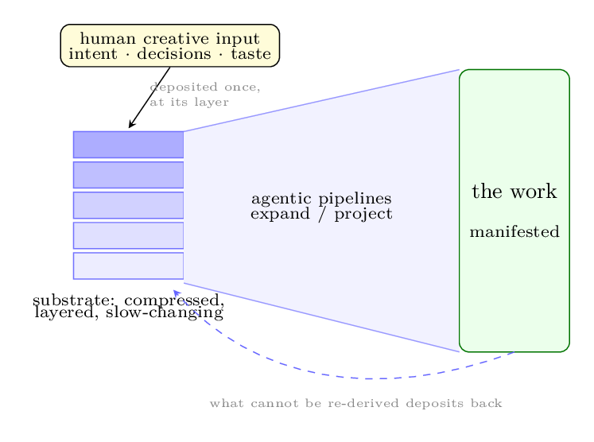
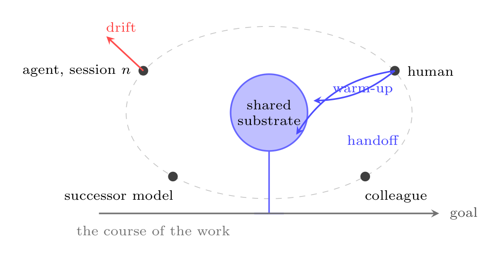
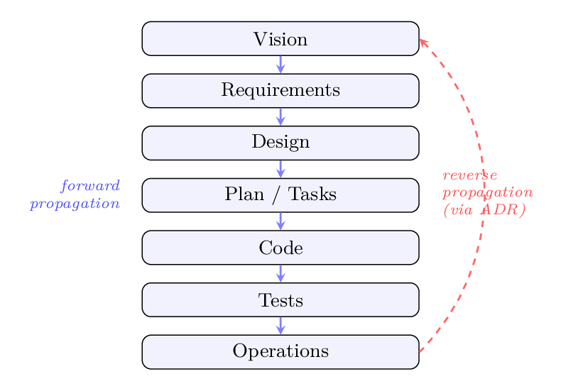
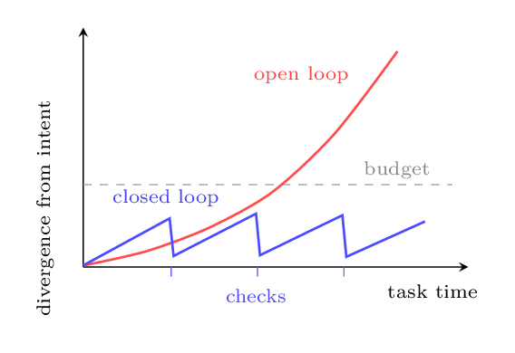
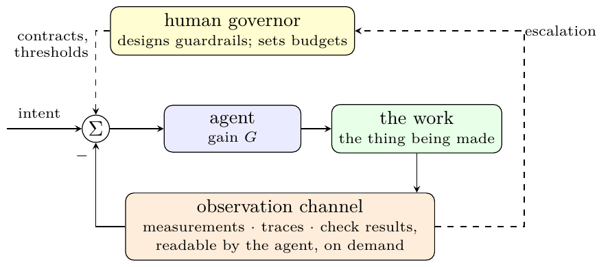

<!--
Render as slides:  npx @marp-team/marp-cli talks/does-the-substrate-matter/slides.md -o slides.html
Or open in VS Code with the Marp extension. Reads as plain markdown on GitHub.

Structure: a core arc of 47 slides (~35-40 min, complete on its own) — section 2 opens
with the paper's frame (the era claim engaging Google's New-SDLC quote, the definition
of "substrate", creative input vs cognitive load, the responsibility inversion, the
historical precedents, the personal evolving substrate) before the evidence, which then
mirrors
research/eval/report/REPORT.md sections 1-5; section 4 includes the deck-building miss
as the evaluation's third self-correction; section 5 ends with the practical adoption
menu. Expansion modules M-A..M-F follow an explicit divider and are optional. NOTES.md
carries the slide map, branch-point plan and if-challenged lines.

Binding rules (see NOTES.md "Standing rules" for the full statement): every number
travels with its caveat ON THE SAME SLIDE; claims never stated more strongly than the
honest captions in report/exhibits.md license; guided-interpretation style, no
aphoristic fragments; experience-shared voice, no prescriptive second person; no
invented setting; self-sufficient for a first-time viewer.

Public-surface rule: this file is committed to the public repo. The work project appears
only as "a legacy component at a regulated financial institution". Where the in-room talk
may name it, NOTES.md says "name verbally".
-->

# Does the substrate matter?

## A case study, the evidence — and what this new era asks of the human

**Two weeks, one legacy component — and seven personal projects instrumented to answer the obvious objection: that one case proves nothing**

*This is not a lecture, and it makes no strong claims. It is one person sharing what happened — with the evidence, and its limits, shown in full.*

Evidence & instruments: [github.com/olegroshka/shared-substrate](https://github.com/olegroshka/shared-substrate) `research/eval/`

---

# 1 · The case, cold

Over two weeks, a legacy component at a regulated financial institution was re-engineered with AI assistance into **19 gated increments** — business-level parity, now running in UAT.

<!-- name the component and employer verbally; they are in the circulated abstract, not in this committed deck -->

That is the whole claim this talk makes about the work project up front. No instrumented numbers — its git history and session logs live inside the org; measuring them properly is a planned follow-up there.

The question to hold for the rest of this talk:

> ### A capable model was necessary — but it is not what made this work. What actually carried it?

---

## The case on its own yardstick

Scored on the same 8-axis adoption rubric as the personal corpus (you'll score your own project on it later):

- **18 / 24 — PROVISIONAL-INFERRED** · 3rd of 8 projects
- High but **not top** — which is what a two-week, timeboxed, brownfield job under partial discipline *should* look like. That is why the number is credible.
- Its mechanics had a **local rehearsal**: a 6-day personal sprint in March prototyped the same behavioural-lock-in pattern (more later).

*Caveats on this number: four of eight axes inferred from a written account, not scored from artifacts; the decisions axis (A5) is the lowest-confidence cell in the whole matrix; the row is refreshed in-org against real history later.*

---

# 2 · What is actually shifting

Google's recent whitepaper on the new software development lifecycle puts it like this:

> *"The most profound shift in software engineering isn't a new language, framework, or cloud service. It's the transition from writing code to expressing intent, and trusting intelligent systems to translate that intent into working software."*
> — Google, *The New SDLC: From Vibe Coding to Agentic Engineering* (2026)

True — and, I will argue, **too narrow**. The code-to-intent transition is one instance of a much broader change.

**The real shift is in how humans engage with information.** Software engineering is simply where it arrives first, because software has built-in ways to check the machine's work — compilers, test suites, an incumbent system to measure against. The same transition is coming to every discipline whose output is durable thinking: documents, decisions, analysis, research.

---

## The word in the title, defined

**The substrate is the externalised state of a piece of work** — everything a sustained effort reads and writes to keep its own thread: what is read at the start of a session, written during it, and left behind for the next one.

Every project has one, whether or not anyone tends it. Untended, it is chat history, scattered notes and human memory. Tended, it is a structured, versioned, cross-referenced set of records — shortest at the top (what and why), detail only below.

The picture is the paper's reading of it: **the substrate is the compressed source of the work.** The repository may be fifty thousand lines; the substrate is the forty pages a person would actually re-read after six months away. That is the sense the word carries for the rest of this talk.

---

## Purpose, in one line

# Separate genuine human creative input from cognitive load.

- **Creative input** — the choices, the intent, the taste. What no pipeline can derive from what is already on record.
- **Cognitive load** — the re-explaining, the re-deriving, the bookkeeping, the expansion. Everything a pipeline *can* derive.

The human writes the first down, **once, at the right layer**. The machinery carries the second.

Everything else in this talk is the engineering required to make that separation real — and measurable.

---

## What offloads — and what cannot

The working test, in plain words: **how surprised would a strong model be by this contribution, given everything already on record?**

| the human produces | surprise | so it is |
|---|---|---|
| renames, formatting, a boilerplate adapter from a schema | ≈ none | **load — the machine's to carry** |
| a summary of a document the agent can read itself | ≈ none | **load — the machine's to carry** |
| *"Settle T+1, not T+2 — the broker's cutoff is 17:30 CET"* | high | **the human's — worth writing down** |
| *"this option list is missing the one path that keeps our goal"* | high | **the human's — worth writing down** |

As models strengthen, more of the table's top half becomes derivable — but the bottom half does not shrink. **The human's contribution moves toward intent and judgment; it does not disappear.**

*(The formal version — conditional description length, the κ measure — lives in module M-F for anyone who wants it.)*

---

## The inversion: your edge becomes your job

When everything derivable is offloaded, what remains is not less work — it is a **different job**:

# Intent, decisions, scope, taste — and the judgment of meaning.

- Whatever the human is genuinely better at than the model stops being a comparative advantage and becomes their **entire responsibility surface** — the areas where the human outperforms the model are, by definition, the areas nothing else can cover.
- The one quality check that cannot be automated is **the human**: model output is *plausible by construction, not correct by construction*, and only the person who holds the intent can tell the difference at the top level.
- Delegation is not the human doing less. **It is the human's effort converging on the only work that was ever irreducibly theirs.**

*(Hold this thought — section 4 includes a live example of this job being done, on this very talk.)*

---

## This transition has run before

**When calculators entered the classroom, many maths teachers fought them** — the fear was that students would stop being able to think. What actually happened: arithmetic stopped being the ceiling. Curricula moved up, and teachers now take students further — into statistics, algebra, calculus — than the pre-calculator classroom ever reached.

**When Jacquard's automated loom arrived in Lyon, silk weavers smashed the machines** — the fear was the end of the trade. Within a decade, France ran on the order of ten thousand Jacquard looms — operated by weavers — and the loom's punch cards went on to become an ancestor of the computer.

**The pattern: the tool absorbs the mechanical layer, and the human's job moves up a level — for those who move with it.** That last clause is the honest part. The transition rewarded the weavers who became operators of the new looms, and it was hard on those who could not or would not move. Which is exactly why the *skill* — the personal substrate, next slide — is what matters.

---

## There is no generic substrate

How should AI assistance be perceived, then? Not as a tool the human adopts, but as a **coupling the two grow together**. And what grows on the human's side is a **personal substrate — individual, evolving, their own**.

- Every element of the discipline in this talk's evidence exists because something went wrong **once**, for this operator, on this project. The practices accumulated from real incidents and were then indexed — none of them was designed up front from a template.
- The same author runs different substrates on different projects, scaled to their complexity — the evidence includes a small CLI project that keeps gates and contracts and correctly skips the rest.
- So an organisation cannot roll a substrate out the way it rolls out a tool. It can only make **growing one cheap** — and teach people what belongs in theirs.
- And the change does not arrive because a few people discuss ideas in a room. It arrives as **continuous implementation at scale**: everyone practising, daily, each closing their own **self-reflection loop** — notice the miss, write the lesson down, work differently tomorrow. A skill is refined the way skills always are: **by repetition with feedback, not by rollout.**

*Your substrate will not look like mine. The evidence in this talk is about whether growing one matters at all.*

---

## The frame in one picture

In this kind of work the **human** supplies intent, decisions and taste; the **pipeline** supplies expansion; a **shared external substrate** carries the state between sessions, tools and minds.

That was the claim going in. Seven projects and six workstreams later, the evidence supports a **sharper, narrower** version —

---

## The thesis, as the evidence left it

> The substrate's measurable benefit is **on the human's side of the loop, not the model's.** A good agent-instruction file and a strong model will retrieve the facts the operator recorded. What they cannot do is make re-entry cheap, keep short messages as delegation rather than assent, or make the operator's reasoning findable later.
>
> The substrate is not what makes a person write things down. It is what makes what they wrote down **still be there, and still be findable, three sessions later.**

Three exhibits carry this. All three measure **operator behaviour repeated across hundreds of turns** — the robust half of the evidence.

---

## The evidence base — seven of my own projects

The answer to the "it's one project" objection: same author, same era, **instrumented rather than remembered**.

| project | what it is | substrate posture |
|---|---|---|
| **blive** | live algo-execution engine (trading) | **full discipline**: decision records, inventories, protocols |
| **btest** | backtesting platform, same domain | **ephemeral**: a 212-line agent-instruction file, no decision records; working files often never reached git |
| b-autobot | 6-day Java sprint — the March rehearsal | partial |
| datacli | small data-ops CLI | light, à la carte |
| smim · harp · seamQ | research projects | research-native instruments (more later) |

**blive vs btest is the central pair** — same author, same trading domain, opposite postures. Evidence: 1,480 session-log turns across three log stores, 600+ commits, every extraction script published. Nothing here is from memory.

*Caveat that governs everything: this is a case comparison, not an experiment — the full confounds ledger comes at the end, out loud.*

---

## Exhibit 1 · The retransmission tax

**Re-entry costs 4× as much, is paid half as often, and moves the wrong way in the ephemeral project.**

A *warm-up turn* is what you type at session start to rebuild context before new work begins.

| | warm-up frequency | cost per warm-up | over project life |
|---|---|---|---|
| **blive** (substrated) | 9 of 10 sessions | ~106 chars | **falling** 192 → 106 |
| **btest** (ephemeral) | 43 of 68 sessions | ~417 chars | **rising** 477 → 607 |

Both projects belong to the same author, working in the same trading domain — so the gap cannot be explained by skill or subject. What the numbers show: the substrated project pays a small re-entry cost that *shrinks* as the project matures; the ephemeral one pays a cost four times larger that *grows*. The operator is re-explaining more and more of his own intent to his own tools as the project ages.

*Denominator: 78 sessions, 1,061 classifiable operator turns. Caveats: btest's sessions also lengthened (9.1 → 19.8 turns); paste bodies survive in only 74 of 204 paste-referencing turns, so payload-shaped warm-ups are under-counted — conservative against this finding.*

---

## Exhibit 2 · What a short message is made of

**Short messages mean different things in the two postures: where a substrate exists they delegate prepared work; where none exists they mostly just tell the agent to keep going.**

A short message can carry a full work order — *"read the prepared task file and execute"* — but only when there is a prepared file to point to. Without one, a short message can only nudge the agent onward. The ratio of work-delegating short messages to bare "continue"-type messages, among all messages under 40 characters:

| seamQ | b-autobot | blive | btest |
|---|---|---|---|
| **5.0** | 0.50 | 0.25 | **0.10** |

btest's operator also typed the *most* short messages: 147 — 19% of everything he typed — and they were overwhelmingly of the "continue" kind.

*These are the four projects with enough surviving session logs to measure. Fragile numerator, stated per the rules: btest's ratio rests on **3** dispatches against 29 "continue"s — two more found dispatches would move it.*

---

## Exhibit 3 · Re-entry is the recurring event the substrate is for

- btest took **16** gaps of ≥5 days across its 213-day history; blive took **1**; datacli **1**.
- After btest's gaps, fix-commits run at 20.8% against an 18.3% baseline — so a single re-entry is **not obviously costlier than normal work**. The difference is frequency: btest paid the re-entry cost sixteen times where the substrated projects paid it once.

There is also a baseline hiding in the same repository. Before the methodology existed (December 2025 to February 2026), btest was already AI-assisted — but with no substrate and no surviving logs. In that era its average change description was **49 characters** long (78 changes). After the methodology arrived, it was **585** (337 changes).

*Caveats: the gap counts are small everywhere except btest, so they are reported as counts, not rates. And the 49-to-585 jump coincides with a change of tools as well as of method — it separates two eras; it cannot separate the two causes.*

---

# 3 · Four practices

Each told the same way:

**what the work project did → the concept underneath → does it generalise** (exhibit from the personal corpus, honest limits attached)

1. Structural decomposition
2. Explicit guardrails
3. System representation
4. Continuous validation

---

## 3.1 · Structural decomposition

**Work project:** the work was cut into 19 increments, each behind a gate with explicit exit criteria — and the system was described layer by layer, starting from the shortest description that captures the intent, adding detail only where the layer below needed it.

**Corpus:** blive ran the same pattern — four gated milestones, exit criteria recorded at each gate, a readiness freeze before each phase. And the discipline is adopted piecemeal, scaling with project complexity: **datacli**, a small 117-file command-line tool, kept the gates, the executable contracts and the status-tagged manifests, and skipped the decision records, the glossary and the session protocol. That is exactly what the complexity-threshold claim predicts for a small project.

---

## Reading every comparison against project complexity

The corpus projects differ enormously in complexity, so the evaluation measured it — size, change history, dependencies, information content — and the **same ordering came out under every measure tried**:

> **btest > b-autobot > blive > harp > datacli > seamQ**

(Agreement across measures: Kendall's W 0.47–0.61, p < 0.001.) No cross-project comparison in this talk is read without this ordering in mind.

*Caveats: seven projects is a small set, so the significance figure is indicative only; smim cannot be ranked at all — its history was lost, and that is recorded as "not available", never as zero; and "project duration" in the data is the span of the git history, which understates seamQ's real life (about three weeks, not the two days its history shows).*

---

## 3.2 · Explicit guardrails

**Work project:** the old system's behaviour was locked in as executable tests before replacement began, and its real production performance numbers became the new system's hard limits.

> *"Gain is indifferent to sign."* — an AI assistant amplifies whatever signal the operator sends, and it cannot tell a right signal from a wrong one. A clear instruction and a subtle misunderstanding are both multiplied into volume with the same fidelity — and work keeps getting built on top of a wrong signal, compounding its cost, until something checks it.

**Which is why guardrails pay back out of proportion to what they cost: anything that helps the operator avoid sending a wrong signal — behaviour locked in executable form, performance limits copied from the existing system's real production numbers — improves the entire trajectory to the goal, not just one step of it.**

**Corpus:** b-autobot is the March rehearsal of the same idea — a regression-test suite that locked in a simulated incumbent's behaviour as **91 executable scenarios** covering its critical surface.

*An honesty note travels with this exhibit: in review, its guardrails score was moved **down** (from 3 to 2), because its performance limits exist only as comments in a configuration file — nothing ever checks them. The top-scoring project was held to 2 for the same weakness.*

---

## What the probe added here — an honest negative

*(The probe — a pre-registered experiment, told in full two slides on: fresh AI-agent instances quizzed against each repo, with checkable ground truth.)*

The predicted mechanism *"stale in-tree references induce confabulation"* **did not fire**.

On both questions built around b-autobot's doc/tree divergence, a fresh agent counted the tree and was right: **91 scenarios, not the docs' 66; CI disabled, not the README badge's live nightly**.

A 2026-era agent checks the code against the doc. What it cannot check is a claim about a **conversation** — which is where the next practice picks up.

*A fragility note: b-autobot's clean sheet depends on two answers where the agent said it could not tell — the scoring deliberately counted those in the project's favour. Counted the other way, they would be two invented answers.*

---

## 3.3 · System representation

> *"Drift is excursion without reversion."* — every project's understanding wanders as work proceeds; that is normal. Drift is what happens when there is no recorded reference point to pull it back to.

The practice the evaluation **changed the most**. Two robust results first — one positive, one null — then the case studies.

**The probe, in one line:** 20 questions per project with checkable ground truth — *did we decide X? what is the state of Y? why was Z rejected?* — put to fresh AI-agent instances with repo-only access, two independent runs each. Questions and scoring frozen by commit **before any run**.

**Robust result 1: facts that are written down come back near-perfectly in *both* arms** (substrated and ephemeral alike). On the questions whose answers are recorded in the repository, blive answered **28 of 28** correctly, btest **28 of 28**, and b-autobot **24 of 28**.
Reading back what was written is **not** where the substrate boundary sits.

*Denominator: 84 recorded-answer questions across three projects, two runs each.*

---

## Robust result 2 · Zero silent reversals

blive keeps its decisions as **53 append-only Architecture Decision Records (ADRs)** — dated, reasoned, citable by stable ID. The question: do later sessions silently contradict them?

**No blive decision record was silently reversed in 12 sessions of exposure — the failures live elsewhere.**

- Survival S(k) — the share of records still standing un-contradicted k sessions after they were written — is **1.000** at every k from 0 to 12.
- The *declared* curve falls only to 0.962 — one record replaced by a successor that says so, on both ends. A declared supersession is the discipline **working**.

**This is the discipline's core promise, tested and kept: the record never quietly rewrote its own history — every change to a recorded decision announced itself.** Two bounds keep that honest. It demonstrates the record's *integrity*, not its downstream effect; and it has no comparison arm, because only one project has decision records at all. The failures the evaluation did find are different in kind — records wrong on the day they were written (section 3.4).

*Honesty notes: by twelve sessions of exposure, only **26 of the 53** records had existed long enough to be tested that far — the curve rests on those. "Sessions" are approximated from commit timing (a gap of four hours starts a new one). 18 of the 53 records were checked directly against the code; the rest are not counted as having passed a test they were never given. And there is no comparison column, because btest keeps no decision records — its entry is "not applicable", never zero.*

---

## The pre-registered experiment, reported as it came out

**My own pre-registered experiment failed to show the substrate reduces confabulation — and the one confabulation belongs to the full-substrate project.**

*(Confabulation: an invented answer presented as recorded fact.)*

- Questions and scoring were frozen by commit **before any run**. The result: no measurable difference between the projects (Fisher's exact test, p = 1.0).
- btest answered 38 of 38 correctly with no invented answers; blive 37 of 38, with the corpus's **only** invented answer; b-autobot 36 of 38.
- And the one invented answer invented a **why** — a rationale for a deliberation that never happened.

*Caveats: the "wrong direction" rests on a single invented answer, so it is weak evidence either way — though the no-difference result would survive any one answer being re-scored. Three of the twenty questions had to be discarded because their answer keys turned out to be wrong — 15% of the instrument — and every one of those discards worked against my hypothesis, not for it.*

---

## Why the null actually supports the revised claim

**A 212-line CLAUDE.md — the project-root instruction file AI coding agents load automatically — plus git history plus a 2026-era model was enough for a perfect retrieval score.**

The baseline has moved. *"Your agent will invent decisions if you don't keep records"* is no longer true of a fresh agent answering questions about recorded facts — and I would rather concede that myself than have it raised from the audience.

The confound is part of the story: the "undisciplined" arm was never truly without records — it had a real, substantial agent-instruction file. That alone may explain the null.

**And a franker retrospective, offered before anyone offers it for me: the original claim was too strong as formulated.** Whether a model invents an answer depends on the model and on what it can read — not simply on whether a discipline is in place. What the experiment actually located is the narrower exposure that survives: where no readable ground truth exists *anywhere* — a reason that was never written down — any model, in any posture, may fill the gap. The corpus's one confabulation was exactly that case.

**btest is ephemeral, not flat** — no exhibit in this talk compares "substrate" against "nothing". The comparison is between records that are durable and citable, and working files that were transient and never referenced.

---

## What actually separates the arms: addressability

**Both repos recorded the same decision the same day; one record is cited from five artifacts, the other from zero.** *(A single paired case — a case study, not a statistic.)*

On 5 June 2026, both repositories made the same decision on the same day — raising their minimum Python version. Same person, same reasoning, recorded twice:

- blive wrote **ADR-053**, a 4,902-character decision record — cited from **five** other artifacts, including the one an AI agent loads automatically.
- btest wrote a 1,025-character change description — and it is a **good** record: the reason, the validation, the exact edits, a flagged follow-up. It is cited from **zero** artifacts, and findable only if you already know that specific change's identifier.
- The blive record even names its btest counterpart in a cross-reference field: the citable record of btest's decision lives **in the other project's repository**.

**The naive story — "the less disciplined project didn't write down why" — is false.** The reasons were recorded in both projects. What differs is whether other records can point to them — and whether anything ever does.

---

## Labelling work is not the same as making it citable

btest's change-log conventions tell a story that is easy to misread. At first glance the discipline collapsed: structured tags on 96% of changes in April, none by July. The honest reading, after breaking the history down by hand:

- Most of the tags belonged to **one research subproject** — when it moved to its own repository in May, its tags left with it. The apparent collapse is mostly the tagged work moving out.
- What actually decayed came earlier: tags carrying a **citable identifier** (`[SMIM DATA-6]`) gave way to bare labels — 163 identifier-tags in March, **2** in April, none after.
- And July is not undisciplined — 9 of its 10 changes use the industry-standard `feat:` / `fix:` labelling.

The distinction that matters:

| `feat(costs):` | `[SMIM DATA-6]` |
|---|---|
| says what **kind** of change this is | says **which piece of work** it belongs to |
| cannot be referenced by later records | a later record can **cite it** |

**The project kept classifying its work; it stopped making it citable. That is the same distinction the Python 3.12 pair just showed — and it is what "addressability" means in practice.** *(Full monthly breakdown in the appendix bench.)*

---

## And the substrate carries state only if artifacts survive

**Everything blive's sessions produced reached git; at least one in nine of btest's working artifacts never did.**

Observed through three independent channels — typed prompts, IDE local-history records, agent tool-call paths — matched against everything ever committed:

| blive | btest | seamQ | b-autobot | harp |
|---|---|---|---|---|
| **0 of 33** ephemeral | **≥10 of 94** *(firm floor 8)* | ≥33 of 89 | 0 | 2 |

All lower bounds — a file never typed and never tool-written is invisible to every channel we have.

*These are the **hand-corrected** figures — the instrument's first run said "at least 26" for btest, and checking every name by hand removed 16 false positives. Two properties of the measurement travel with it: every kind of error it can make **inflates** a count (and blive's zero cannot be lowered), so the measurement noise favours my own hypothesis — which is why the hand-check that shrank it mattered; and one of the three channels can only see projects whose session logs still exist, so blive's own ten agent-memory files were invisible to it.*

---

## Where the discipline itself failed

For balance — the same audit's findings *against* the discipline, in the project that scores 22 of 24:

- The summary table *inside* the decision log went stale — two wrong statuses, two missing rows out of 53 — while the project-level inventory stayed correct. **What goes stale is the index, not the records.**
- Two mistyped cross-reference links were copied forward into 20 of the project's 26 broken links — because people cite by copying. An append-only record preserves errors with the same fidelity it preserves decisions.
- One record documents an **"operator decision" for an option that was never actually on the table** — a record system can manufacture history as well as preserve it. *(A single case, resting on the operator's recollection.)*

And the probe question designed to catch a decision that lived *only* in conversation — made verbally, never written anywhere — failed to find one in three independent attempts. That supports writing everything down; but proving an absence is hard, so it is stated as **"we could not find one," never "they do not exist."**

---

## 3.4 · Continuous validation

**Work project:** parity against the incumbent as the oracle; checks in the loop.

> *"An oracle the agent cannot query is an audit, not a guardrail."* — if the assistant cannot run the checks itself, while working, then problems are found at review time — after dependent work has already been built on top of them.

---

## The rework contrast

**Four fifths of every line the ephemeral project added was later deleted — against one line in twenty.**

| | reversed, any horizon | within 14 days |
|---|---|---|
| blive | **5.2%** | 3.9% |
| btest | **82.2%** | 32.6% |

**The confound is stated wherever this number appears:** btest's history is **5× longer** (213 vs 41 days), giving its lines more time in which to be deleted, and the projects differ in nature. **This is supporting texture, not a controlled result.**

*Denominators: tens of thousands of added lines per repository. The line-matching method is approximate, and its known biases are documented alongside the data; the 14-day column is only comparable for the three projects whose histories are long enough to support it.*

---

## Two honest findings that cut against my own case

**First: how much a project tests has more to do with what the project *is* than with how disciplined it is.**

| project | share of files that are tests, early → late |
|---|---|
| b-autobot *(a regression-test suite by design)* | 0.79 → 0.72 |
| btest | 0.13 → 0.35 |
| blive | 0.22 → 0.30 |
| harp · seamQ *(research)* | one test file · none |

The research projects are not unchecked — their checks simply take a different form: pre-registered hypotheses, adversarial review of drafts.

**Second: both the most and the least disciplined project produced a record that was factually wrong on the day it was written — and neither had any mechanism that could have caught it.** Every check either project owns — indexes, status fields, cross-references, warm-up files — verifies records when they are *read later*, never when they are *written*.

That gap suggests a simple, testable improvement — seen working only once, so nothing more is claimed for it: any factual claim written during a review should name the exact file and line it was read from, so it can be verified at the moment of writing.

---

# 4 · The research, examined

| claim | verdict |
|---|---|
| 1 · Attention migrates up; substrate enables it | **Partial** — visible only after controlling for message length (closing exhibit) |
| 2 · Failure modes follow absent substrate | **Split** — the human-side half (restart cost) is supported; the model-side half (invented decisions) showed **no effect**, and was too strong as formulated (§3.3) |
| 3 · Same author, same domain, with/without | **Weak** — the comparison project was never truly "without" records (§3.3) |
| 4 · Exploratory research is out of scope | **Supported, and refined** — research work carries *its own* substrate instruments (pre-registration is a frozen intent contract) |

---

## The standing reminder

> **METR (2025): experienced developers were 19% slower with AI tools — while believing they were 20% faster.**

Including the author's own felt productivity. Every positive number in this talk is read against that result.

The same class of tools measures **+26%** in large field experiments (gains concentrated in less experienced developers) and **+56%** on well-specified greenfield tasks. The moderators that reconcile them — task abstraction level, codebase maturity, operator experience — are substrate-shaped.

Two of the sharpest items in this evaluation — the survivorship confound and the fragility ledger — exist because the **operator pushed back on the evaluation**, not because an instrument caught them.

This ledger is what separates the talk from advocacy.

---

## What the experiment failed to show — 1 of 4

### The pre-registered experiment found no effect.

No measurable difference between the projects (p = 1.0) — and such direction as there was pointed the wrong way: the corpus's only invented answer belongs to the full-substrate project.

*(Told in full in section 3.3. The four negatives are listed one by one, deliberately — four separate findings, not a pattern.)*

---

## What the experiment failed to show — 2 of 4

### The operator's attention level does not track discipline inside btest.

*(Attention level: every message the operator types, classified by the level it works at — declaring intent, making decisions, shaping design = **high**; pasting errors, steering line-fixes, re-explaining context = **low**. The full exhibit comes in a moment.)*

**The month with the least record-keeping discipline had the second-highest attention level.**

| btest, by month | Mar | Apr | May | Jun | Jul |
|---|---|---|---|---|---|
| share of high-level operator messages | 0.256 | 0.251 | 0.192 | 0.400 | 0.303 |
| share of tagged commits | 91% | 96% | 50% | 40% | 0% |

If discipline and attention level moved together, these two rows should rise and fall together. They do not — so the hoped-for within-project migration is **not supported**.

*Caveats: June rests on only five messages; and as the earlier slide showed, the tag row is largely the story of one subproject leaving — which weakens this comparison even further.*

---

## What the experiment failed to show — 3 of 4

### btest's instruction file does not decay silently.

**Of the 74 rules the file has ever held, 28 were withdrawn — and every single withdrawal was explained** (25 of them in one commit that announced a scope change). The hypothesis going in was the opposite: that rules would quietly disappear.

*The method errs against this finding: rewording a rule counts as removing one and adding one, so if anything the withdrawal count is inflated. And this covers the committed file only — rules in working files that never reached the repository are unobserved.*

---

## What the experiment failed to show — 4 of 4

### Zero blive ADRs were silently reversed.

The drift the discipline exists to prevent **was not found in the discipline's own record**. The real failures were records that were **wrong on the day they were written** — one in each project, at the moment of writing, where neither project has a check.

---

## And two corrections this evaluation applied to itself

- btest's ephemeral-artifact floor: published **≥26 → corrected ≥10** (16 false positives, itemised by hand).
- The tag-decay curve: reread as a **composition change**, not "discipline went to zero".

> **Each time this corpus has been read adversarially, its headline numbers have got smaller and its argument narrower.** That trend has not turned around — and a third careful reader would probably find something too.

Which is the strongest reason this talk presents the *reframe*, not the original claim.

---

## The miss that reframed this deck: context pulls intent off course

Days before this talk, the agent that built these slides — holding the **entire evaluation report** in context — produced a deck perfectly faithful to that report and **illegible to anyone without it**. It passed every check it had. Every one of those checks compared the slides to sources the agent was *holding*; none asked what a reader **without** them would see.

It was caught by the operator, applying a rule written down nowhere: *a presentation must be self-sufficient.*

**The mechanism deserves a name: the weight of everything the agent held pulled its reading of the task toward what it knew.** It optimised for faithfulness to its own context, when the intent was legibility to a reader outside it.

The same shape appears elsewhere in this evidence *(each seen once — a recurring shape, not a statistic)*:

- a record that cited the very row refuting it — it read the pointer's **status**, never its **content**;
- an option list that silently dropped the one option that would have kept the original goal;
- these slides — every fact correct, the intended reader missing.

**In each case the agent satisfied every explicit requirement and missed the intent those requirements implied.** The check that would catch this — putting the artifact in front of a reader who holds none of the author's context — is this evaluation's own probe method, pointed at deliverables instead of repositories. Until that check exists, making the catch is the human's job. **This is the inversion from section 2, demonstrated live: supplying the judgment the model cannot is now the operator's core responsibility.**

---

## Closing exhibit · Where the human's attention actually went

**Comparing messages of similar length, the ephemeral project's operator worked at the lowest level in every length group.**

Every one of 1,061 operator messages was classified by what it does: declaring intent, making decisions, shaping design (**high level**) versus mechanical steering — *paste this error, fix that line* (**low**). The share of high-level messages, blive vs btest, grouped by message length:

| under 40 chars | 40–119 | 120–399 | 400+ |
|---|---|---|---|
| **0.19** vs 0.08 | **0.26** vs 0.15 | **0.42** vs 0.35 | **0.80** vs 0.65 |

btest is lowest of the four measurable projects in **all four groups**.

*Why the length grouping matters: without it, the comparison mostly measures how long each message is — and the least substrated project comes out on top. So no attention-level number in this talk is shown without its length group. Method notes: the automated classifier agreed with the author's hand labels on 95% of a held-out sample (κ = 0.902) — but there was only one labeller, so that shows consistency, not independent agreement.*

---

## The confounds ledger, out loud

1. **No controls** — case comparison, not experiment (except the probe, which was controlled — and came back null).
2. **Learning effect** — discipline and skill co-evolved; not separable here.
3. **Selection** — projects chosen by the person evaluating his own methodology.
4. **Instrument circularity** — the rubric operationalises the author's own method; never shown without an outcome measure.
5. **Log coverage** — uneven transcripts; the substrated project's early sessions are gone.
6. **Artifact survivorship — the most serious, because it is correlated with the treatment.** Every artifact-based measurement sees a *surviving* subset, and the bias runs **with** the hypothesis. Measured, then hand-corrected; the framing is *ephemeral*, not flat.

About five findings rest on hundreds of observations; about seven rest on a single event. **Every robust finding measures operator behaviour repeated across sessions; every fragile one measures an agent's behaviour on one question.** The reframe rests entirely on the robust half.

---

# 5 · Score your own project

The handout: **four practices, eight questions, 0–3 each.** Two minutes, honest answers.

**Step 0 is the complexity check** — days of work, one person, few decisions? **Stop: flat notes are the right tool.** The discipline predicts its own irrelevance below the threshold — "score low and simple" is a fine place to be. (datacli is the in-corpus demonstration: à-la-carte at 117 files.)

The spectrum to place yourself on:

| blive | smim | work-project | datacli | harp | b-autobot | btest | seamQ |
|---|---|---|---|---|---|---|---|
| 22 | 20 | 18 *(provisional)* | 17 | 16 | 15 | 12 | 7 |

*Caveats, on the slide rather than in an appendix: the rubric can only score what survived in each repository — working files that were deleted before being committed are invisible to it; seamQ's 7 scores the deliberately stripped tree it published, not the fuller workspace it worked in; and the rubric was written by the person whose method it measures — which is why its scores are never shown without the outcome evidence you just saw.*

---

## The practical takeaway — adopt one piece, where it hurts

Nothing in this talk argues for adopting the methodology wholesale. **This menu is the four practices from section 3, unbundled** — each element is one piece of project state made durable and readable by the assistant, which is what "substrate" means in practice. The honest move is to pick the row that targets what already hurts:

| practice | if this is what hurts | one element to adopt *(and its cost)* | seen in this talk's evidence |
|---|---|---|---|
| Decomposition | a big change delivered as one risky leap | the work cut into gated increments with explicit exit criteria *(a planning session)* | 19 increments, each behind a gate — parity held at every step |
| Guardrails | one component everyone is afraid to touch | its current behaviour locked in as executable tests *before* changing anything *(about a day)* | 91 scenarios locking in the incumbent before replacement began |
| Guardrails | performance regressions surface at review time | hard limits copied from the running system's production numbers, checkable by the assistant mid-work *(about a day)* | the work project's final week was spent almost entirely inside those limits |
| Representation | "did we decide this, and why?" lives in memory and chat history | an append-only decision log with citable identifiers *(minutes per decision)* | the same decision recorded twice on the same day — only the citable copy was ever cited again |
| Representation | the same fact maintained in several documents, drifting apart | one authoritative home per fact; everything else points to it *(a habit, not a tool)* | one copied error propagated into 20 broken links — while the single-source register stayed correct |
| Validation | every session starts with re-explaining the project | a pointer file the AI assistant loads automatically, plus a one-page project inventory *(an hour, once)* | session openers: ~106 characters and falling with one; ~417 and rising without |

Each element pays back independently; together they compound — **the full discipline is just the limit of the compounding.** And the one near-universal prerequisite is free: **stable, citable identifiers** — the same addressability that section 3.3 showed deciding which reasons stay findable.

---

## The closing question

None of this is new with AI. A surgeon can say *"scalpel"* — one word, carrying a complete instruction — only because an entire structure already exists around it: instruments laid out in a known order, roles assigned, a shared protocol. That structure is not free. The operating room pays to maintain it, deliberately, because it converts long explanations into short commands that cannot be misheard.

**Every well-run team has always made this trade: maintaining shared structure costs effort, and it pays for itself in the shortness and safety of every instruction that follows.** The substrate is the same trade, made with a collaborator that reads.

> ### So — when you type a short message to your AI assistant, is it delegating prepared work, or just telling it to keep going?

---

## What this evaluation is not allowed to claim

- Whether the substrate causes better **outcomes** — the proxies are behavioural.
- Whether it works for **anyone else** — one author, one domain family, one model era.
- Whether the *practised* substrate differed from the *recorded* one where content is unrecoverable.
- Anything about **team** collaboration — every project is single-operator.
- The work project's instrumented numbers — those exist only inside the org, until the follow-up leg runs there.

---

# Close

- The shift is bigger than "code to intent": it is a change in **how humans engage with information** — software is only where it arrives first.
- The measurable benefit is on the **human's side of the loop**: re-entry stays cheap, short messages stay delegation rather than nudges, and reasoning stays findable.
- Recorded facts come back near-perfectly **in both arms** — the baseline has moved. What separates the arms is whether the *reasons* were recorded, and whether other records can cite them.
- Neither posture checks a claim **at write time** — and catching what the model's pattern-matching misses is now the operator's defining responsibility.
- Your substrate will be **personal and evolving** — and below the complexity threshold, flat notes win; the discipline says so itself.

**The substrate is not what makes a person write things down. It is what makes what they wrote down still be there, and still be findable, three sessions later.**

Paper, field manual, evidence: [github.com/olegroshka/shared-substrate](https://github.com/olegroshka/shared-substrate)

---

# Expansion modules

**Everything after this slide is optional** — pulled in as the room's appetite dictates, any order. The core arc you just saw is complete without them.

- **M-A** · The eight-project spectrum in depth
- **M-B** · War stories with receipts
- **M-C** · Session-log deep dive
- **M-D** · The probe protocol
- **M-E** · Git archaeology
- **M-F** · The measurement programme

---

## M-A · The spectrum in depth (1/2)

| Axis | blive | smim | P8 | datacli | harp | b-autobot | btest | seamQ |
|------|-------|------|-----|---------|------|-----------|-------|-------|
| A1 layers | 3 | 2 | 2? | 2 | 1 | 1 | 1 | 0 |
| A2 gates | 3 | 3 | 3? | 3 | 3 | 2 | 1 | 0 |
| A3 contracts | 2 | 2 | 3? | 3 | 3 | 2 | 2 | 2 |
| A4 protocol | 3 | 2 | 1? | 1 | 1 | 2 | 1 | 0 |
| A5 decisions | 3 | 2 | 2?? | 2 | 2 | 1 | 1 | 1 |
| A6 inventories | 3 | 3 | 2? | 2 | 2 | 2 | 2 | 1 |
| A7 oracles | 2 | 3 | 3? | 2 | 2 | 3 | 2 | 2 |
| A8 observability | 3 | 3 | 2? | 2 | 2 | 2 | 2 | 1 |
| **/24** | **22** | **20** | **18?** | **17** | **16** | **15** | **12** | **7** |

*`?` = inferred from the written account (P8 refreshed in-org later); `??` = the matrix's lowest-confidence cell. Two scores were adjudicated **down** in review — both against this talk's own argument.*

---

## M-A · The spectrum in depth (2/2)

**The ordering defies the naive story.** Research projects score mid-high — via **research-native** instruments:

- harp: a pre-registration with stop-for-futility rules — **a frozen intent contract**.
- smim: notation sheet + kill rules.
- seamQ: a three-persona adversarial-review pipeline — built, used, then **deliberately stripped at publication** (its 7/24 scores the stripped tree).

The boundary claim refines: exploratory work has *different substrate artifact types and lifecycle* — not no substrate.

**Inverse profiles:** b-autobot (guardrails + validation) and blive (representation + session protocol) are strong on opposite axes — the four practices are separable in practice.

---

## M-B · War stories with receipts

Four incidents, each **behind the robust number it illustrates** — n = 1 each, never aggregated:

1. **The hole named forty days before anything fell into it** *(behind the rework contrast)* — a chaos drill filled the failure-modes knowledge base (KB-7), which the project's artifact inventory had registered as MISSING — with an owner and a content contract — at the repo's **first commit**. An absence that is registered, named and assigned becomes a work item instead of an unknown.
2. **The option that was not on the list** *(behind the altitude exhibit)* — an agent-drafted option set silently dropped the only intent-preserving path; the operator caught it. An option list steers by omission.
3. **One session, two defects, in the 22/24 project** *(behind the null)* — a substrate-only audit session manufactured a decision **and** recorded a claim that was never true — while citing the row that refutes it. The cheap testable fix (n=1, a proposal, not a finding): audit records carry the `file:line` each claim was read from.
4. **104,959 lines, and the reasoning is in a chat log** *(behind the retransmission tax)* — the corpus's largest deletion has a 1-byte commit body; the rationale survives only in a session store retained by accident. The rules were captured on the day; the reasoning behind them was never given a place other records could cite.

*Three of four are the substrated project's — it is the only project with retros to read incidents from. That is a selection property of the evidence.*

---

## M-C · Session-log deep dive

**Corpus:** 1,480 turns / 168 sessions across three log stores; **1,061 classifiable operator turns**; exclusions counted.

- **Altitude instrument:** four classes, nine boundary rules, frozen after hand-labelling 99 stratified turns *before* the classifier was written. Held-out agreement 0.947 (κ = 0.902) on the high/low collapse — *one-rater stability, not IRR*. The four-way split is noisier and is not used for exhibits.
- **Warm-up detection** is prefix-based per session; paste bodies survive in only 74 of 204 paste-referencing turns → warm-up costs are floors.
- **Orientation cost is inconclusive and shown only as the honest refusal:** the substrated project produced both the *cheapest and the most expensive* orientation in the corpus (118,735 and 447,000 tokens, n=2). A 3.8× within-project spread supports no directional claim.

*Coverage caveats: the substrated project's transcripts are gone (logs start after 30 of its 70 commits); the ephemeral project's pre-methodology era has no recoverable transcript at all.*

---

## M-D · The probe protocol

**Pre-registered:** questions, scoring rubric and hypotheses frozen by commit (`ab9c62d`) **before any run**. 20 questions × 3 projects × 2 runs; fresh agent, repo-only access, isolation verified (the subject once tried to list its own memory directory — denied by the guard).

- Scoring: correct / abstained / confabulated, ties resolve **against** the hypothesis; a sensitivity reading (SC9) published alongside.
- **3 of 20 slots voided on ground-truth failure — 15% of the instrument** — every void ran *against* the hypothesis. No key edited, no answer regenerated.
- The review adopted a standing evidence rule: "we decided X" needs an artifact that **states** the decision; a diff can ground a claim about code state, never about a decision.
- The one stable orientation difference is **completeness, not cost**: the substrated project stated 4 of 4 key facts in both runs; each other project missed the *same* fact twice.

*The protocol is written to re-run unmodified inside any org, under any agent CLI — that is the work-side follow-up leg.*

---

## M-E · Git archaeology

| project | rework any-horizon | fix% | gaps ≥5d | root litter |
|---------|-----------|------|----------|-------------|
| blive | 5.2% | 10.4% | 1 | 1 |
| btest | 82.2% | 18.3% | 16 | 26 |
| b-autobot | 47.4%† | 14.0% | 0 | 0 |
| datacli | 3.7%† | 20.0% | 1 | 0 |
| harp | 0.7% | 0.0% | 1 | 0 |
| seamQ | 90.9%† | 8.0% | 0 | 1 |

*† shorter than the 14-day window — that column is whole-history rework, not fast rework; the 14-day comparison is licensed only for blive/btest/harp. Churn is a blame-free LIFO approximation; commit classes are regex-based with published precedence; every metric travels with the complexity profile.*

**Reversal narration:** the substrated project narrates its reversals (8/8 genuine on hand-read, 11.9 per 100 commits); the ephemeral one reverses 82% of its lines and narrates once in 415 commits — **shown with the prose-volume confound: 362.5 vs 62.7 words/commit; per-10k-words the automated gap is 2.1×, not 50×.**

---

## M-F · The measurement programme

The paper proposes accounting for validated intent: κ (non-derivable bits) × v (oracle-validated) × s (survived k sessions) — and a calibration gap (felt vs validated volume) as METR's finding made continuous.

**What this evaluation actually delivered of it:**

- **s(k), the survival term, is computable on a real project** — the zero-silent-reversals curve *is* s(k) for decision records, with `at_risk` denominators and a frozen definition of "silent".
- **κ was not attempted** — first in the cut order; a half-baked estimate is worse than none. No numbers exist, and none are claimed.
- The round-trip design: the instruments (rubric, probe protocol, miners — stdlib-only, portable) cross into the org; **only cleared aggregates come back**.

*Roadmap status: one data point of a research programme, honestly labelled — not a validated metric.*

---

## Appendix pointer

Every number in this deck, with its source file, honest caption and the caveat that travels:

- `research/eval/report/REPORT.md` — the argument, sections 1:1 with this deck
- `research/eval/report/exhibits.md` — the full exhibit bench (23 exhibits, 5 groups)
- `research/eval/METHODS.md` — instruments, definitions, the rules, and what the study cannot answer
- `research/eval/data/` — every extracted metric, per project

**Nothing in the bench is mandatory; nothing shown in this talk is caveat-free.**
